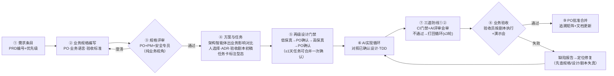

# C-TDS 城市可信数据空间平台 · 项目研发章程与开发规范
（AI 智能体驱动的 Vibe Coding 场景 · 全员无编程经验约束版）

| 文档信息 | 内容 |
| --- | --- |
| 产品名称 | 城市可信数据空间平台（City Trusted Data Space，C-TDS） |
| 文档版本 | V2.4 |
| 编制日期 | 2026-09-05 |
| 文档状态 | 发布稿（项目启动基线） |
| 上位文档 | 《城市可信数据空间PRD》V2.0（AI 融合版，2026-09-05 评审通过为产品基线；本文与其冲突时，以 PRD 与后续正式变更单为准） |
| 支撑文档 | 《01-vibe coding最佳实践调研报告》《02-AI开发风险与对策手册》 |
| 适用范围 | C-TDS 项目全体人员（均无编程经验）、全部 AI 编码智能体及 AI 辅助工作流 |

## 修订记录

| 版本 | 日期 | 修订说明 |
| --- | --- | --- |
| V1.0 | 2026-09-05 | 首版 |
| V2.0 | 2026-09-05 | **重大修订**：确立"全员无编程经验"约束。取消一切人工代码评审与代码级审查要求；质量保障重构为"机器门禁 + AI 多视角评审会审 + 人工业务功能验收"三道防线；角色体系按能力短板重新界定职责边界；新增第 9 章无编程经验成员操作指引；新增验收剧本、演示会、缺陷报告等业务维度机制；新增技术栈平庸化、门禁无特批、外部顾问审计等补偿性控制 |
| V2.1 | 2026-09-05 | **新增强制会话纪律**：① 每次会话结束必须编写或增量更新项目开发日志，命名 `Ctds-项目开发日志-yy-mm-dd-hhss`；② 单会话单任务；③ 上下文达 50% 完成当前最小步骤即停，禁止以压缩续命；④ 停止前"续点"四要素落盘（已完成/下一步/关键决策/文件指针）；⑤ 新会话一律读最新日志与 AGENTS.md 冷启动，禁止凭旧会话记忆继续任务。落点：总则第 8 条、3.3、9.1、9.4、附录 A6/A7/G |
| V2.2 | 2026-09-06 | **开发日志命名规则修正（用户指示）**：3.3.3 时间戳由"首次创建时点"改为"**随最近一次落盘同步更新**"——每次内容落盘后按当时时间重命名文件（`git mv` 保留历史；重命名与提交动作本身不再触发重命名）；同步修订 AGENTS.md 1.4、附录 A7。另：补齐 V2.1 升版时头部版本号遗漏；上位文档更新为 PRD V2.0（产品基线） |
| V2.3 | 2026-09-06 | **开发日志留存规则调整（用户指示）**：由"同一任务在原日志上增量追加"改为"**每次任务结束新建一份日志文件**（一次成文、落盘核对后即为定稿），历史日志只读归档，错漏以文中补正说明标注；续接会话新建自己的日志并引用此前日志"——过程留痕更清晰、冷启动定位更可靠（文件名排序即最新）；同步修订 AGENTS.md 1.1/1.4、README、章程 9.1/3.2、附录 A7/G |
| V2.4 | 2026-09-06 | **新增"两级设计门禁"（用户指示）**：正式编码前必须完成低保真→确认→高保真→确认两级设计，设计未经 PO 确认不得进入编码。全部开发任务分形态适用（界面类 = 页面线框 + 静态 HTML 原型与界面说明书；非界面类 = 业务可读行为清单与接口契约；纯文档/流程类任务卡可声明免设计；S2/S3 缺陷修复按免设计处理）；工作量 ≤1 天的任务卡两级可一并提交、一次确认。标准协作流程由八步改九步；评审智能体①扩为"规格与设计符合性"。落点：2.3/2.4/2.5、新增 2.6、3.2（docs/designs/）、4.2、9.1、附录 A2/A8、B1/B2、F/H |

---

## 总则：八条不可违背的原则

本项目采用"AI 智能体承担全部编码与技术质量责任、人类成员专注业务与流程"的研发模式。**本团队全部成员不具备编程经验，一切人工评审与测试只能从业务功能维度展开，无法提供代码质量层面的审查。**以下八条原则优先于一切局部效率考量：

1. **规格先行**：没有评审通过的业务规格（Spec），不启动任何开发；规格是代码的唯一事实源。
2. **人管业务，AI 管代码，机器把关**：人类成员不做、也不试图做任何代码级判断（阅读、评审、修改、"看懂"代码）；技术质量由 CI 自动门禁与 AI 评审会审承担；人类对项目的判断依据只有三种信号——业务规格、机器门禁结果、功能演示结果。
3. **验证闭环**：一切 AI 产出必须有机器可执行的验证手段；AI 声称"已完成/已通过"必须附本地可复跑的验证结果，人只核对"绿灯"信号本身。
4. **可演示**：完成 = 现场演示通过（Demo or it didn't happen）。未经业务验收的功能一律视为未完成。
5. **最小实现**：只实现规格中明确列出的行为（YAGNI）；AI 的改进建议写进交付说明，不擅自实现。
6. **门禁无特批**：任何自动化门禁红灯不允许"先合并后补"的例外。无编程团队无法评估例外风险，因此例外通道一律不设。
7. **安全默认**：等保三级、国密、数据不出域是默认前提；任何"为了跑通"而绕过安全机制的产出不允许进入主干；对安全红线存疑即停止并上报。
8. **会话纪律与日志强制**：单会话单任务；会话上下文用量达到 **50%** 时，完成当前最小步骤即停止任务；停止前必须将"续点"落盘项目开发日志（已完成 / 下一步 / 关键决策 / 文件指针，四要素缺一不可）；新会话一律以最新日志与 `AGENTS.md` 冷启动，**禁止凭旧会话记忆继续任务**；禁止以自动或手动压缩（compact）延续复杂任务。

---

## 1. 项目目标与范围界定

### 1.1 项目定位（引自 PRD）

面向地方数据集团/数据局的城市级数据流通利用基础设施平台，对标《可信数据空间 技术架构》"空间服务平台 + 接入连接器"标准架构，具备可信管控、资源交互、价值共创三大能力，内置运营计量计费与 AI 语料供给能力，交付模式以政务云/国资云私有化部署为主。

### 1.2 项目目标

| 编号 | 目标 | 对研发的要求 |
| --- | --- | --- |
| G1 | 标准合规 | 架构解耦：标准适配层（信通院测评/互联互通相关接口）独立模块演进，一次通过测评 |
| G2 | 快速建设 | 3 个月交付 V1.0 P0 全量；交付物含标准镜像与自动化部署工具链 |
| G3 | 可持续运营 | 上架-订购-合约-交付-计量-分账全闭环功能可演示、可运营 |
| G4 | AI 就绪 | 预留语料汇聚/治理/供给的模块边界与数据模型（V1.0 仅预留，不实现） |
| G5 | AI 研发质量 | 在无人具备代码审查能力的约束下，主干变更失败率 ≤10%，严重缺陷逃逸 ≤2 个/迭代，里程碑外部技术审计高危问题 = 0 |
| G6 | 团队可运转 | 全部工作流程对无编程经验成员可执行：每个岗位有逐步操作手册，每个决策有人可读的判断依据 |

### 1.3 范围界定

**V1.0（T+3 个月，本项目范围）= PRD 全部 P0 功能：**

| 模块 | P0 功能项 |
| --- | --- |
| 主体与身份 | C-1.1 主体注册与实名认证、C-1.2 分布式数字身份（DID） |
| 逻辑空间 | C-2.1 空间创建、C-2.2 成员与权限、C-2.3 隔离与策略继承 |
| 目录与资源 | C-3.1 资源登记、C-3.2 统一目录、C-3.3 产品封装上架 |
| 合约与使用控制 | C-4.1 合约模板、C-4.2 协商签署、C-4.3 使用控制策略引擎 |
| 交付 | C-5.1 API/文件交付、C-5.2 数据沙箱 |
| 连接器 | C-6.1 标准连接器、C-6.2 连接器生命周期管理、C-6.3 多源适配 |
| 运营 | C-7.1 产品门户、C-7.2 计量计费中心 |
| 存证审计 | C-8.1 区块链存证、C-8.2 合规审计 |
| 系统管理 | C-10.1 多租户与三员分立、C-10.2 监控运维 |

**V1.0 明确不做（防止范围蔓延）**：C-1.3/1.4、C-3.4/3.5、C-4.4、C-5.3/5.4、C-6.4、C-7.3/7.4/7.5、C-8.3、C-9.1/9.2、C-10.3 及一切 P1/P2 功能。需求方提出时一律走第 7 章变更流程。

### 1.4 硬性约束（直接转化为验收门槛）

| 类别 | 约束（引自 PRD 第 6 章） | 验收方式 |
| --- | --- | --- |
| 性能 | 门户并发 ≥1000；API 网关吞吐 ≥2000 TPS；目录检索响应 ≤500ms | 压测报告（AI 生成、专员按清单核对，见 6.5） |
| 可用性 | 平台可用性 ≥99.9%；核心交付链路同城双活 | 故障演练 + 外部技术审计 |
| 安全 | 等保三级；数据分类分级；国密 SM2/SM4 传输加密；KMS 密钥管理 | 自动扫描 + 外部测评（人工不做代码级安全审查） |
| 兼容性 | 主流国产数据库/操作系统/政务云；适配 ≥3 家隐私计算厂商（V1.0 预留接口层） | 兼容性矩阵测试 |
| 可运维性 | 部署工具链、一键巡检、灰度升级 | 部署演练（按运维手册逐步执行） |

### 1.5 里程碑

- **M1（T+1 个月）**：工程基建就绪（CI/CD、全套自动门禁、AI 评审流水线、骨架代码、核心领域模型与 ADR）；主体身份、逻辑空间模块通过业务验收演示。
- **M2（T+2 个月）**：目录、合约与使用控制、交付、连接器主链路贯通；性能与安全专项测试首轮完成；**第一次外部技术审计**。
- **M3（T+3 个月）**：P0 全量 + 运营门户 + 存证审计 + 系统管理；内部验收（全功能演示）与信通院测评预演，具备提交测评条件；**第二次外部技术审计**。

---

## 2. 角色分工与协作流程

### 2.1 角色体系设计的两条铁律

1. **人类角色全部按"无编程经验"配置**：任何岗位的说明书都不得包含"阅读代码""评审代码""判断技术方案优劣"等要求；需要技术判断的事项，一律由 AI 智能体产出**业务可读的结论与选项**，人基于业务影响做选择。
2. **职责边界用"禁止项"写清**：每个角色除"必须做"外，必须明确"禁止做"，防止无编程经验成员因不了解风险而误操作。

### 2.2 人类角色（全部可由无编程经验人员担任）

| 角色 | 必须做（职责） | 禁止做（边界） | 专属决策权 |
| --- | --- | --- | --- |
| 项目经理（PM） | 计划、进度、风险、资源、对外沟通；主持变更评审会与演示会 | 不做技术方案选择的技术判断（依据架构智能体的"业务影响对比表"做业务性选择） | 里程碑调整、范围承诺、发布放行、主干回滚批准 |
| 产品负责人（PO） | 用业务语言编写需求与规格；定义验收标准；批准验收剧本；需求澄清与变更裁决 | 不阅读代码；不批准未通过三道防线前两道的 PR | 需求优先级、规格批准、业务验收通过/打回、变更分级 |
| AI 编排师（可多名，按模块分工） | 按第 9 章 SOP 驱动 AI 智能体完成"规格→实现→自验→提交"；核对三类信号（门禁绿灯/评审通过/演示通过）；维护会话与任务笔记 | **不阅读、不修改、不评判代码**；不连续纠正同一 AI 会话超过 2 次（必须重开或升级）；不绕过任何门禁 | 所提交任务的流程合规性；发起升级 |
| 业务验收员（可由 PO 兼任或独立） | 按"验收剧本"逐步执行功能测试；按模板记录缺陷；参加演示会 | 不做代码级验证；不凭"感觉"放行（判定只依据剧本执行结果） | 剧本执行的通过/失败判定 |
| 安全与合规专员 | 管理 AI 工具白名单与数据红线；核对自动扫描报告（按人工核对清单）；组织等保与外部测评事务 | 不做代码级安全分析（依据 SAST/SCA 工具报告与 AI 安全评审结论） | 安全红线解释、AI 工具准入、合规放行 |
| 发布与运维专员 | 按 AI 维护的运维手册（runbook，逐步操作说明）执行部署、巡检、升级、回滚；盯监控告警 | 不手写脚本、不改配置文件内容（变更一律由 AI 产出、按手册执行） | 环境操作执行时机（经 PM/PO 批准后） |
| 外部技术顾问（外聘，强烈建议） | 里程碑技术审计（M2/M3）、重大架构方案复核、S0 事件技术溯源 | 不介入日常开发；不承担项目管理 | 审计结论与整改建议（对 PM 与全体有约束力） |

> **关于外部技术顾问**：在全员无编程经验的约束下，代码级质量完全依赖自动化与 AI 评审，存在系统性残余风险（详见 4.5）。聘请外部顾问在 M2/M3 各做一次技术审计（每次 2–3 人日）、并预留 S0 应急支持通道（48 小时内可响应），是本章程强烈建议的兜底措施，请 PM 落实预算。若确不可行，须在风险登记册中记录为已接受的高风险并升级补偿措施（更保守的范围、更长的测试周期）。

### 2.3 AI 智能体角色

| 智能体角色 | 职责 | 能力边界 |
| --- | --- | --- |
| 架构智能体 | 技术选型与方案设计；对每个重大决策输出 2–3 个方案的**业务影响对比表**（成本、工期、风险、对运维的影响，用业务语言） | 只提方案与推荐，不代人选；方案未经批准不得实现 |
| 编码智能体 | 按规格实现功能、写自动化测试、跑验证、提交 PR；**对代码正确性与技术质量负全责（人类无审查能力，AI 是第一责任人）** | 不得实现规格外行为；不得引入未批准依赖；不得使用非主流/小众技术（4.1） |
| 评审智能体 ×4（新鲜上下文，互相独立） | ① 规格与设计符合性：diff 对照验收标准与已确认高保真设计逐条核验；② 安全与供应链：漏洞模式、依赖风险、密钥；③ 一致性与重复：是否复用既有组件、重复代码；④ 测试质量：断言有效性、异常路径覆盖、与验收标准映射 | 只报告影响正确性、安全或需求符合性的问题；不得批准自己参与的实现（实现与评审必须不同会话） |
| 测试智能体 | 生成自动化测试用例与代码；为每个 PRD 条目生成**人工验收剧本**（业务语言、逐步操作） | 不得为让测试通过而修改断言迁就错误实现；剧本须可被无编程人员逐步执行 |
| 文档智能体 | 维护两套文档：面向 AI/外部顾问的技术文档（ADR、API 文档）；面向团队的业务可读文档（系统说明书、运维手册、操作指引） | 事实必须来自代码/规格/ADR，禁止编造 |
| CI 门禁（流水线） | 执行第 4 章全部自动检查并给出红绿灯 | 机器执行，任何人不得绕过或关闭（配置由架构智能体变更并留痕） |

### 2.4 人在回路（Human-in-the-Loop）决策点

| 决策 | 谁批准 | 判断依据（必须是人可读的） |
| --- | --- | --- |
| 需求优先级与规格批准 | PO | 业务语言规格 + 验收标准 |
| 架构/技术选型 | PM + PO（重大项加外部顾问复核） | 架构智能体出具的"业务影响对比表" |
| 依赖/组件引入 | 安全专员（流程登记）+ 评审智能体②（技术结论） | SCA 报告 + 许可证清单 + 评审结论 |
| PR 合并 | PO | 三道防线前两道全绿 + 业务验收通过（PO 批准的是"业务验收通过"，不构成代码正确性判断） |
| 发布上线 | PM + PO + 安全专员 | 上线检查单（附录 B）全项通过 |
| 主干回滚/紧急变更 | PM 批准，运维专员执行 | 回滚 runbook |
| 低保真/高保真设计确认 | PO | 两级设计文件（业务语言）；界面类另附静态 HTML 原型（章程 2.6） |

### 2.5 标准协作流程（规格驱动 · 九步）



各步骤准入/准出：

| 步骤 | 准入 | 准出 |
| --- | --- | --- |
| ② 业务规格 | PRD 条目确认 | 规格含：PRD 编号、用户故事、**业务语言**验收标准（Given/When/Then，描述用户可见行为）、非目标、外部依赖；规格澄清智能体的歧义清单已处置 |
| ③ 规格评审 | 规格完整 | PO 批准；安全专员确认数据红线相关内容 |
| ④ 方案与任务 | 规格已批准 | 方案对比表经人选择并形成 ADR（含业务影响说明）；任务卡 ≤1 天工作量；验收剧本初稿生成；任务卡标注设计型态（界面类/非界面类/免设计，见 2.6.2） |
| ⑤ 两级设计 | 任务卡就绪（型态已标注） | 低保真经 PO 确认方向；高保真经 PO 确认定稿（≤1 天任务卡可两级一并提交、一次确认）；设计文件已落盘 `docs/designs/`；无规格外设计项（铁律见 2.6.1） |
| ⑥ AI 实现 | 已确认的高保真设计 + 剧本就绪 | 编码智能体自验全绿（编译/测试/lint/扫描）+ 实现与已确认设计逐条一致 + AI 自检单（附录 B）完成 |
| ⑦ 三道防线①② | PR 提交 | CI 门禁全绿；4 个评审智能体结论均为"通过"或"已处置"（①含设计符合性）；循环 ≤3 轮，超限升级 |
| ⑧ 业务验收 | 前两道通过 | 验收员按剧本逐步执行通过 + 演示会演示通过 |
| ⑨ 合并 | ⑧ 通过 | PO 在 PR 批准；追溯矩阵、验收剧本、文档同步更新 |

### 2.6 两级设计门禁（低保真 / 高保真，强制）

> 设计依据：人是业务唯一的确认者，但业务语言的规格不直接等于可编码、可演示的形态。在"规格批准"与"编码启动"之间插入两级设计确认，让人在写代码之前先看见并认可"将要做什么、长什么样、怎么运作"；方向性错误在低保真阶段拦截，成本远低于编码后返工。

**2.6.1 三条铁律**

1. **设计从规格派生**：设计只允许细化和具象化规格已批准的行为；发现规格缺口、矛盾或遗漏 → 停止设计，走第 7 章变更流程，**禁止在设计里私自补全需求**。
2. **设计确认是业务确认**：人确认的是页面长相、操作步骤、业务规则、报错文案等业务可见内容；**不要求也不构成对技术方案优劣的判断**——技术正确性仍由 AI 智能体负全责（原则 2 不变）。
3. **未确认不编码**：高保真设计未经 PO 确认，任务卡不得进入实现（步骤⑥）；实现与已确认设计不一致属于评审打回项，须改设计重新确认后方可继续。

**2.6.2 任务分型与产物形态**（任务卡在步骤④标注型态）

| 型态 | 低保真（方向确认） | 高保真（定稿确认，即编码契约） |
| --- | --- | --- |
| 界面类（有用户可见页面） | 页面线框与流程草图：页面清单、每页结构（区块/字段/按钮）、页面间跳转与主要流程 | 浏览器可打开的静态 HTML 原型（每页可点开，含报错与空态示意）+ 界面说明书（逐页布局说明、字段清单、操作步骤、状态与报错文案、边界值） |
| 非界面类（后端/组件/基建） | 一页方案要点：做什么/不做什么、结构组成、主要流程 3–5 步、待确认问题清单 | 业务可读详细设计：行为清单（与规格验收标准逐条对应）、接口契约表（路径/方法/入参/出参/错误码）、数据结构、边界值与异常行为 |
| 免设计类 | 纯文档、流程、无行为变更的机械任务：任务卡声明免设计及理由，编排师核对后方可省略两级设计 | — |

补充：S2/S3 缺陷修复按免设计处理（附录 A4 自带"原因说明 + 修复方案一句话确认"停点）；S0/S1 缺陷修复涉及行为口径变化的，先按第 7 章更新规格再修复。

**2.6.3 确认节奏与打回**

1. 两次确认停点：低保真确认"方向对不对"，高保真确认"细节定不定"；确认动作 = 人在设计文档头部"确认记录"块签署结论（确认 / 打回 + 意见）；
2. 任务卡工作量 ≤1 天的，两级可一并提交、一次确认；
3. 同一设计被打回 2 次 → 停止重做，按 9.5 升级（通常指向规格质量问题，回查步骤③）。

**2.6.4 产物与文件管理**

1. 设计文件落盘 `docs/designs/`，以任务卡编号命名（如 `C-4.3-lofi.md`、`WBS-2.4.4-hifi.md`）；界面类原型页放 `docs/designs/<任务卡编号>/prototype/`（入口 `index.html`）；模板见附录 H 与 `docs/templates/设计文档模板.md`；
2. 设计确认是"等待人工确认"停机点：设计落盘后按 3.3.3 落盘开发日志收工；编码在新会话冷启动，必读已确认的高保真设计（附录 A2 第一步）；
3. 设计确认后的修改：文字勘误按 B 级变更；涉及行为或验收口径的按 A 级变更走第 7 章。

### 2.7 协作节奏

- 迭代周期 2 周；每日异步站会（昨日 AI 产出摘要 + 今日任务 + 阻塞）；每周质量看板评审（门禁通过率、缺陷趋势、剧本覆盖、债务登记簿）。
- 迭代评审会 = **演示会**：逐条演示本迭代验收剧本执行，不播放文档、不接受"代码已完成"的口头陈述。
- 所有任务、决策、变更在工单系统/文档库留痕，口头约定无效。

---

## 3. AI 工具与提示词使用规范

### 3.1 工具白名单

1. 只允许使用《AI 工具白名单》内的工具（安全合规负责人维护并发布）。准入标准：企业级合约、承诺输入数据不用于训练、支持私有化部署或已通过数据出境合规评估。
2. **个人账号、未评估工具不得处理任何项目资产**（代码、PRD、客户信息）。
3. 白名单内的工具按任务分配权限：编码智能体授予仓库读写与本地执行权限；评审智能体只读；无人值守批量任务使用受限命令白名单。
4. 主模型 + 备用模型双轨备案；更换模型视为环境变更，先在基准任务集上评测再全面启用。

### 3.2 仓库规则文件体系（AI 的"长期记忆"）

| 文件 | 内容 | 维护责任 |
| --- | --- | --- |
| `AGENTS.md`（根目录） | AI 必读总则：技术栈、命令、结构、红线、流程入口 | 文档智能体起草，PM 批准 |
| `.agents/rules/*.md` | 分领域细则：后端规范、前端规范、测试规范、安全规范 | 架构智能体起草，外部顾问里程碑审计时复核 |
| `docs/adr/` | 架构决策记录（编号 ADR-001 起，**必含"业务影响说明"字段**） | 架构智能体起草，PM+PO 批准 |
| `docs/domain/` | 领域参考：国密组件用法、DID 规范要点、信通院接口约定、等保要求摘编 | 架构智能体维护 |
| `docs/specs/` | 业务规格（C-x.y 编号，业务语言） | PO |
| `docs/tasks/` | 跨会话任务笔记（决策、进度、未解决问题，业务可读） | AI 编排师 |
| `docs/designs/` | **两级设计文档**（低保真/高保真，按任务卡编号命名；界面类含静态 HTML 原型，见 2.6） | 编码智能体起草，PO 确认 |
| `docs/logs/` | **项目开发日志**（会话级强制维护，命名 `Ctds-项目开发日志-yy-mm-dd-hhss.md`，见 3.3） | 会话内 AI 起草，AI 编排师核对 |
| `docs/manuals/` | 面向人的操作指引：各岗位 SOP、运维 runbook、验收剧本库 | 文档智能体维护，PO/运维专员确认 |
| `config/` | 构建质量配置（checkstyle 等，随工具链接入扩充） | 架构智能体维护，变更走门禁配置流程 |
| `docs/templates/` | 交付模板库（PR 描述模板、自检单等，随用随增） | 文档智能体维护 |

规则：所有 AI 会话开始时必须先读 `AGENTS.md`、**最新开发日志**（续接任务读该任务日志，见 3.3）与当前任务对应规格；`AGENTS.md` 只放"AI 推断不出且违反会犯错"的信息，定期删减。

### 3.3 会话管理与开发日志制度（强制）

> 设计依据：上下文越满模型表现越差（context rot），且压缩会不可控地丢失关键细节（调研报告 01 §2.1/§2.2）。因此本项目以"短会话 + 日志续点"取代"长会话 + 压缩"，以下规则无例外。

**3.3.1 单会话单任务（强制）**

1. 一个会话窗口只处理一个任务卡；禁止在同一会话中混做其他任务、"顺手"处理别的需求或进行无任务卡的自由探索。
2. **两错即清**：同一问题纠正两次仍未解决 → 停止纠缠，按 3.3.3 落盘日志（含教训）后重开会话并升级（9.5）；"干净的会话 + 更好的提示"几乎总是优于堆满纠正的长会话。
3. **探索隔离**：跨模块调研交给子智能体/独立会话，只把业务可读结论（≤2 千字）带回主会话，并写入日志或任务笔记。

**3.3.2 上下文 50% 停机规则（强制）**

1. 会话上下文用量达到 **50%** 时：完成当前**最小步骤**（一个原子动作，如一个测试的修复、一次文件提交、一段文档的写入）后**立即停止**，不开启任何新的工作项；
2. 停止前必须完成开发日志落盘（3.3.3），然后由人启动新会话续接；
3. **宁可提前停机，不得越过 50%**：AI 每完成一个阶段性步骤主动估算并报告上下文用量；AI 编排师同时监控工具界面的用量指示；任一方判断接近 50% 即触发停机流程；
4. 50% 预算的意义：为收尾验证、日志落盘与意外处置留足空间，避免"满负荷时被迫草草收场"。

**3.3.3 开发日志制度（强制）**

1. **触发时机**：每次会话结束前（即单个任务收尾时）必须**新建一份**项目开发日志，无论结束原因是任务完成、50% 停机、"两错即清"重开、还是等待人工确认——**没有日志的会话结束即为流程违规**；
2. **命名与存放**：`Ctds-项目开发日志-yy-mm-dd-hhss.md`，存放于 `docs/logs/`；`yy-mm-dd` 为日期，`hhss` 为 4 位时分（24 小时制，如 20:35 记为 `2035`）；**时间戳 = 本日志最近一次内容落盘时点**——内容修正后按当时时间重命名文件（用 `git mv` 保留历史；重命名与提交动作本身不再触发重命名，避免无限递归）；
3. **留存规则（一任务一份，过程留痕）**：每份日志对应一次会话收尾、**一次成文**，落盘核对后即为定稿；**禁止在既有日志上增量追加或回改历史记录**（发现错漏以文中"补正说明"标注，不删改原文）；续接任务的新会话**新建自己的日志**，头部"当前续点"承接上一份日志的续点，并在"文件指针"中引用此前日志；`docs/logs/` 内文件名排序即时间序，最新日志 = 文件名最大的一份；
4. **续点四要素**（每次落盘必须齐备，写入日志头部"当前续点"块）：
   - **已完成**：截至停机已完成并可验证的工作；
   - **下一步**：下一个最小步骤的确切描述（含文件路径与第一个动作，粒度"可直接开工"）；
   - **关键决策**：本会话做出的决策、理由及关联文档位置（规格/ADR/任务卡编号）；
   - **文件指针**：本任务相关文件路径清单（规格、验收剧本、ADR、代码模块、测试、任务笔记、此前日志）；
5. **责任分工**：会话内 AI 按附录 G 模板起草，AI 编排师核对四要素齐备、内容与实际相符后提交入库；
6. **模板**：见附录 G；落盘与冷启动的提示词见附录 A6/A7。

**3.3.4 新会话冷启动规则（强制）**

1. 新会话第一步 = 读取 `AGENTS.md` + **最新开发日志**（续接任务读该任务日志）+ 对应规格与任务卡，重建工作状态后方可动手（提示词模板附录 A6）；
2. **禁止凭旧会话记忆继续任务**：不得以聊天记录截图、口头转述、粘贴旧会话输出等方式向新会话注入上下文——唯一合法的状态来源是开发日志与仓库文件；
3. 冷启动后 AI 必须复述"当前任务 + 日志续点"，与人确认一致后才从"下一步"继续。

**3.3.5 禁止压缩续命（强制）**

禁止以自动压缩（auto-compact）或手动压缩（/compact 等）作为延续任务的手段——压缩对关键信息的丢失不可控，其风险高于停机重启的成本。上下文达 50% 一律停机落盘重启；确需长期保留的结论必须写入日志、任务笔记或 ADR，而不是留在会话里。

### 3.4 提示词规范

**标准结构（六段式，全部模板化，见附录 A）**：`【背景】需求编号与规格路径` → `【任务】要做什么` → `【约束】必须遵守的规范/复用组件/不得改动范围` → `【验收】如何验证（测试命令、剧本引用）` → `【输出】交付物清单（含业务可读验证包）` → `【复述】动手前先复述理解，人确认后开工`。

**对 AI 产出的强制要求（弥补无代码审查的补偿控制）**：
1. **业务可读验证包**：每个交付必须附"给非程序员的验证说明"——改了什么功能、如何演示、验收剧本是否需要更新；
2. **自检先行**：提交评审前必须完成 AI 自检单（附录 B）并附结果，人只核对单据；
3. **声明义务**：复用声明、规格外实现声明、高风险点自查（并发/事务/加解密/性能）照旧执行，作为评审智能体的输入。

**禁止**：口头传达需求变更；让 AI 自由发挥优化未评审方案；在提示词中粘贴真实密钥、客户数据；未复跑验证直接采信"已通过"。

### 3.5 AI 使用红线（违反即追责）

1. 禁止将项目任何资产输入白名单外工具；
2. 禁止安装/引用未经注册表核验与流程审批的依赖包（防幻觉包/供应链攻击）；
3. 禁止让 AI 自行实现密码学算法（一律调用统一国密组件）；
4. 禁止将生产数据、真实密钥、个人信息作为 AI 输入；
5. 禁止 AI 直接推送/合并主干；
6. 禁止绕过、关闭、修改 CI 门禁配置（配置变更只能由架构智能体发起并留痕）；
7. 禁止人工编辑任何自动生成的代码文件（人发现问题用缺陷报告，由 AI 修复）。

---

## 4. 质量保障体系（原"代码质量与评审标准"）

> **本章的根本约束**：人工评审与测试只能从业务功能维度展开，**不设人工代码评审环节**。代码质量由"第一道防线（机器门禁）+ 第二道防线（AI 评审会审）"承担，人承担第三道防线（业务功能验收）。三道防线全部通过才可合并。

### 4.1 技术栈平庸化原则（无编程团队的生存前提）

1. 只使用主流、文档丰富、AI 训练语料覆盖最充分的技术（具体清单以 ADR-001 为准）；**禁止**小众框架、前沿未成熟组件、需要"炫技"的实现方式。
2. 理由：AI 生成质量与该技术的主流程度正相关；出现问题时外部顾问最容易接手；未来若引入人类工程师，接手成本最低。
3. AI 在同一功能有多种实现选择时，**必须选择最普通、最常见的写法**，并在交付说明中说明选择理由。
4. 技术栈清单冻结在 ADR-001，新增任何框架/中间件都算架构变更，走第 7 章变更流程。

### 4.2 三道防线

**第一道 · CI 机器门禁（技术质量的底座，不可绕过、无特批）**

| 门禁 | 工具示例 | 阈值 |
| --- | --- | --- |
| 编译+静态类型 | Maven/Gradle/TS 严格模式 | 零错误、零新增警告 |
| 格式与风格 | Spotless/Checkstyle、ESLint/Prettier | 零违规 |
| 单元测试 | JUnit/Vitest 等 | 全部通过；核心模块行覆盖 ≥80%、整体 ≥70%、含分支覆盖 |
| 测试有效性 | 变异测试（核心模块必做，普通模块抽检） | 变异杀除率 ≥60%，不足列入加固计划 |
| 重复度 | PMD CPD/jscpd | 5+ 行重复块新增 = 0（**无例外通道**） |
| 复杂度 | SonarQube | 圈复杂度 >15 的提交被自动打回（AI 必须拆分后重交，**无特批**） |
| 安全扫描 | Semgrep/SonarQube SAST | 安全热点 = 0 |
| 依赖扫描 | OWASP Dependency-Check/SCA | 高危漏洞 = 0；许可证通过审查 |
| 密钥扫描 | gitleaks | 命中 = 0 |
| 模块依赖 | ArchUnit/dependency-cruiser | 符合分层与模块依赖规则 |

**第二道 · AI 评审会审（4 视角独立智能体，新鲜上下文）**

| 视角 | 检查内容 | 输出 |
| --- | --- | --- |
| ① 规格与设计符合性 | diff 对照验收标准与已确认高保真设计：超范围项、未实现项、偏离设计项 | 逐条对照表 |
| ② 安全与供应链 | 漏洞模式、依赖风险、密钥、敏感日志 | 问题清单（分级） |
| ③ 一致性与重复 | 是否复用既有组件、重复实现、架构约定违背 | 问题清单 |
| ④ 测试质量 | 断言有效性、异常路径覆盖、与验收标准映射完整性 | 测试评估报告 |

会审规则：实现与评审必须来自不同 AI 会话；任一视角不通过 → 打回编码智能体修复后重审，**循环 ≤3 轮**；第 3 轮仍不通过 → 升级（9.5：拆小任务/更换模型/外部顾问）。评审通过后由文档智能体生成"待验收报告"（业务语言），交第三道防线。

**第三道 · 人工业务功能验收（本项目质量保障的重心，详见第 6 章）**

- 形式：验收剧本执行 + 迭代演示会；
- 人的判定依据是**业务行为是否符合规格**，而非任何代码信息；
- PO 的合并批准含义是"业务验收通过"，不构成、也不声称构成代码正确性判断。

### 4.3 编码规范（约束对象是 AI，人无需理解）

保留以下 AI 必须执行的规定：分层架构（`接口层→应用服务→领域层→基础设施`，Controller 不得直连数据层）；横切能力（分页、鉴权、错误码、日志、加解密、幂等、分布式锁）一律复用 `common` 公共组件；信通院测评/互联互通相关实现收敛到 `std-adapter` 模块；统一错误码体系、禁止吞异常；标识符英文见名知义，注释只解释"为什么"；加解密一律走国密封装组件。

### 4.4 架构治理（ADR）

新增中间件/框架、跨模块数据模型变更、对外接口契约、性能关键方案、部署拓扑（双活/灰度）必须先有 ADR。ADR 必填字段：背景、决策、理由、备选项、**业务影响说明**（给非技术读者的成本/工期/风险描述）、影响范围。重大架构决策（双活、区块链选型、核心数据模型）须外部顾问复核后由 PM+PO 批准。

### 4.5 残余风险声明（必须向全体与相关方明示）

自动化门禁 + AI 评审会审不能 100% 等价于资深工程师的代码审查，尤其是：跨模块深层交互缺陷、非典型并发问题、性能悬崖、以及"AI 评审盲区重叠"（四个评审智能体可能共享同类盲点）。本项目接受的补偿控制为：技术栈平庸化、门禁无特批、高覆盖率与变异测试、里程碑外部技术审计（M2/M3）、S0 应急专家通道。**若不落实外部顾问审计，本章程判定项目处于不可控质量风险状态，PM 必须将此作为最高优先级风险上报决策方。**

---

## 5. 版本管理与分支策略

### 5.1 仓库策略

- **单仓为主（monorepo）**：平台各微服务、前端、公共组件、部署脚本、文档同仓管理；连接器 SDK 若需独立分发，单独建仓并版本化发布（以 ADR-002 确认）。
- 仓库内禁止提交：构建产物、密钥、大型二进制（用制品库）。

### 5.2 分支模型（基于主干的短分支）

| 分支 | 用途 | 生命周期 |
| --- | --- | --- |
| `main` | 唯一事实主干，随时可部署 | 永久，受保护 |
| `feat/C-x.y-短描述` | 功能开发 | ≤3 天 |
| `fix/C-x.y-短描述` | 缺陷修复 | ≤2 天 |
| `release/v1.0` | 发布冻结与测评版本 | 里程碑期间 |
| `hotfix/v1.0.x` | 生产紧急修复（自 release 切出，修复后双回主干与 release） | ≤1 天 |

保护规则：`main` 与 `release/*` 禁止直接推送；合并必须走 PR 且满足三道防线全绿；`release/*` 仅允许缺陷修复与安全补丁。

### 5.3 提交与合并规范

- Commit 格式：`<type>(<scope>): <C-x.y> <摘要>`，type ∈ feat/fix/refactor/test/docs/chore；由 AI 生成、编排师核对后提交。
- 合并采用 Squash Merge；PR 有效变更 ≤400 行，超出由编码智能体自动拆分任务。
- **合并前置条件（三道防线全绿）**：CI 门禁绿灯 + AI 评审会审通过 + 业务验收（剧本 + 演示）通过，PO 在 PR 批准。人无法判断代码质量不是流程缺陷，而是本模式的设计前提——技术把关已前置到前两道防线。

### 5.4 版本与制品

- 语义化版本 `MAJOR.MINOR.PATCH`；镜像 tag 与 Git tag 一一对应并附 SBOM。
- 主干每日构建 nightly 镜像；里程碑出 `release` 版本并归档部署工具链（G2）。

### 5.5 AI 并行开发纪律

1. 多智能体并行时使用独立工作树（git worktree）或独立分支，按任务卡事先划分模块归属，禁止并行修改同一模块。
2. 批量机械任务：先在 2–3 个文件上试跑并请人核对**业务效果** → 确认后再全量，且必须开 PR。
3. 无人值守任务使用受限权限白名单（仅允许编辑指定目录、运行测试与 commit），保留完整执行日志。

---

## 6. 测试与验收标准（重心：业务功能验证）

### 6.1 双轨测试体系

| 轨道 | 内容 | 谁做 | 人的参与方式 |
| --- | --- | --- | --- |
| **自动轨** | 单元/契约/集成/E2E 自动化测试；性能与安全扫描 | AI 编写与维护，CI 执行 | 只看红绿灯与报告结论，不审查测试代码（测试代码质量由评审智能体④与变异测试把关） |
| **人工业务验收轨** | 验收剧本执行、迭代演示会、UAT | 业务验收员、PO、（必要时）真实用户代表 | 全程主导，是本项目的质量重心 |

### 6.2 验收剧本（Acceptance Script，核心机制）

每个 PRD 条目（含每个缺陷修复）必须有一份验收剧本，由测试智能体生成、PO 批准：

- **内容**：前置条件（账号、数据、环境）→ 逐步操作（打开什么页面、点什么按钮、输入什么值）→ 每步预期结果（文字 + 截图基准）→ 通过判定 → 失败时如何记录。
- **要求**：全程业务语言，无编程知识即可执行；每份剧本可在 15 分钟内执行完毕；一个 PRD 条目可有多个剧本覆盖不同场景（正常流 + 主要异常流，如"授权到期后调用被拒绝"）。
- **映射**：规格中每条 Given/When/Then 必须映射到至少一个剧本步骤或一个自动化用例（由评审智能体①④核验映射完整性）。
- **高危场景专项**：使用控制策略引擎（C-4.3）每个策略必须有"策略生效 + 绕过尝试被拒"两个剧本；计费（C-7.2）必须有账单核对剧本；个人数据场景必须有授权撤回剧本。

### 6.3 迭代演示会（Demo or Fail）

- 每迭代结束举行演示会：PO 主持，全体参加，逐条现场执行本迭代验收剧本；**不接受截图汇报与口头陈述**。
- 演示失败 = 该功能未完成，回到缺陷流程；演示通过 = PO 签署业务验收。
- 里程碑演示会 = 全链路场景串联演示（入驻→接入→上架→订购→合约签署→交付→计量→审计）。

### 6.4 缺陷报告规范（业务语言，附录 E 模板）

无编程成员发现问题时只描述**现象**：标题、复现步骤（照剧本写）、预期结果 vs 实际结果、截图/录屏、发生时间与环境（哪个网址/环境）。**禁止猜测原因**；原因定位由 AI 依据缺陷报告完成，产出修复 PR（走完整三道防线）+ 业务语言的原因说明。

### 6.5 性能与安全验收（工具产出，人工按清单核对）

| 项 | 门槛 | 执行与核对方式 |
| --- | --- | --- |
| 门户并发 | ≥1000 | 压测由 AI 配置执行，产出报告；安全专员按核对清单检查报告关键数字与结论 |
| API 网关吞吐 | ≥2000 TPS（P99 <500ms） | 同上 |
| 目录检索 | ≤500ms（万级目录数据集） | 同上 |
| 可用性 | ≥99.9%，核心链路双活 | 故障演练按 runbook 执行（运维专员操作），结果记录留痕 |
| 等保三级/国密 | 全项通过 | SAST/DAST 自动扫描 + 外部测评机构测试；安全专员核对清单；人工不做代码级安全分析 |
| 信通院测评（G1） | 一次通过 | M2 起按测评大纲演练；`std-adapter` 通过互联互通契约测试（自动轨）后申报 |

### 6.6 质量指标与缺陷管理

自动轨指标（覆盖率、变异杀除率、门禁通过率、缺陷密度）由 CI 自动汇总进每周质量看板，无需人工采集。

| 等级 | 定义 | 修复 SLA（主干/发布） |
| --- | --- | --- |
| S0 | 数据泄露、安全漏洞、资损（计费错误）、主干不可用 | 立即 / 24h（hotfix） |
| S1 | 核心流程阻断（交易/交付/合约/审计） | 2 天 / 下个补丁 |
| S2 | 功能缺陷有绕行方案 | 5 天 / 下迭代 |
| S3 | 轻微问题 | 排期 |

S0/S1 缺陷必须做逃逸分析：由 AI 完成（哪个门禁失灵、如何改进），产出业务语言报告，结论转化为门禁或流程改进项；技术原因存疑时请外部顾问复核。

---

## 7. 需求变更管理机制

### 7.1 变更分级

| 级别 | 定义 | 审批 | 响应 |
| --- | --- | --- | --- |
| C 级 | 文案/界面文字等非行为性修正 | PO 书面确认 | 随下个 PR |
| B 级 | 规格澄清（原 PRD 语义内消除歧义） | PO 更新规格 + 同步更新验收剧本 | 当前迭代 |
| A 级 | 需求变更（改变验收标准/接口/数据模型，仍属 V1.0 范围） | 变更评审会：PM+PO+安全专员（重大项加外部顾问） | 评估后排期 |
| S 级 | 范围变更（引入 P1/P2 功能或新模块） | PM+PO，必要时升级客户决策 | 里程碑重排 |

### 7.2 变更流程（规格先行，五步强制）

1. **提变更单**：工单系统记录（编号、级别、动机、影响面）；
2. **先改业务规格**：批准后 PO 更新 `docs/specs/` 对应文件；技术影响评估由架构智能体出具业务影响说明；
3. **同步更新验收剧本**：剧本不变 = 变更没完成（测试智能体执行）；
4. **再改代码**：新会话、新任务卡、新分支执行，走完整三道防线；
5. **更新追溯矩阵**：PRD 编号 → 规格 → ADR → 任务 → 代码 → 测试 → **验收剧本** 七层映射保持一致。

### 7.3 冻结期

- 每个 milestone 前 2 周（M2/M3 前）进入 A 级变更冻结（S 级例外）；信通院测评申报后 `release/*` 冻结，仅 hotfix。
- 冻结期内的紧急需求升级 PM 裁决，并记录影响评估。

### 7.4 变更纪律红线

1. 禁止"聊天里说了就算"——任何需求变化未落规格前，AI 拒绝实现（写入 AGENTS.md）；
2. 禁止 AI 自行解释模糊需求并实现（B 级澄清流程强制）；
3. 每次变更评审会核查：是否影响已通过测评的接口、是否影响合约/计费等资金语义、是否需要数据迁移（三项均由架构智能体预先评估并在变更单中给出业务影响说明）。

---

## 8. 风险管理与应急预案

### 8.1 风险登记册（项目级，月度刷新）

| 编号 | 风险 | 来源 | 应对策略 | 责任人 |
| --- | --- | --- | --- | --- |
| PR-1 | 公共数据授权政策各地差异，合约/授权需逐城适配 | PRD §10 | 策略模板引擎+配置化（C-4.1 设计为模板驱动） | PO |
| PR-2 | 客户数据供给不足导致平台空转 | PRD §10 | 运营辅导包（非研发范围，交付物含运营机制） | PM |
| PR-3 | 信通院标准演进导致测评返工 | PRD §10 | `std-adapter` 独立演进；契约测试隔离 | 架构智能体+PM |
| PR-4 | 政务云环境异构拉长部署周期 | PRD §10 | 标准镜像+自动化部署工具；M1 完成部署演练（按 runbook） | 运维专员 |
| TR-1~TR-13 | AI 研发十三类风险（含 R13 系统性能力缺口） | 《02-AI开发风险与对策手册》V1.1 | 按手册逐项规避与检测；本章程第 4/6/9 章为制度落地 | PM 牵头 |
| XR-1 | 3 个月工期与 P0 范围冲突 | 排期 | 范围熔断：优先砍实现深度（保接口与验收标准），不砍门禁与安全 | PM |
| XR-2 | 隐私计算厂商适配接口不明确 | PRD 兼容性 | V1.0 仅定义抽象接口层 + 1 家参考实现，预留 ≥3 家适配点 | 架构智能体 |
| XR-3 | 全员无编程经验，AI 依赖单点、无人工兜底 | 团队构成 | 第 4 章三道防线 + 技术栈平庸化 + 外部顾问里程碑审计 + 应急专家通道（见 4.5、R13） | PM |
| XR-4 | 团队 AI 协作技能不齐导致流程执行走样 | 新模式 | 启动周培训（第 9 章操作指引 + 演练）；每周复盘；模板与 SOP 持续沉淀 | PM |

### 8.2 应急预案

| 场景 | 处置流程 |
| --- | --- |
| S0 安全事件（密钥泄露/漏洞被利用/生产数据风险） | ① 立即按 runbook 吊销密钥/下线受影响服务；② 启动外部应急专家通道（48h 内响应）支持技术溯源；③ hotfix 走紧急通道（仍需全部自动门禁）；④ 24h 内出业务语言事件报告与整改项 |
| 缺陷逃逸到主干/发布 | 回滚优先于修复：PM 批准 → 运维专员按回滚 runbook 执行；随后 AI 做逃逸分析（业务语言报告） |
| 门禁与 AI 评审全绿、但业务验收失败 | 优先怀疑**规格或验收剧本失真**（而非代码）：PO 先修规格/剧本（B 级变更），再进入缺陷流程；连续 2 次发生 → 触发流程复盘 |
| AI 评审循环 3 轮不通过 | 升级路径：拆小任务重试 → 更换备用模型 → 携完整任务档案求助外部顾问 |
| AI 服务不可用/限流 | 切换备用模型（知识资产模型中立可即切）；仍不可用则暂停开发、转为测试与文档工作，2 天以上启动进度预警与范围熔断评估 |
| 工具/模型升级导致行为漂移 | 升级视为环境变更：先跑基准任务集评测，通过后再全面启用 |
| 数据合规事件（项目资产流入不受控工具） | 立即停止该工具使用、评估泄露面、报告安全专员，按合规要求处置并复盘白名单制度 |
| 进度熔断（XR-1） | 里程碑前 2 周评估：关键路径延期 >1 周 → 按预排序"可降级清单"收缩实现范围（保接口合规与验收标准，深度特性后置），PM 主持决策 |

### 8.3 停止法则（任何成员可触发）

1. 同一功能演示连续 2 次失败 → 暂停该功能后续开发，先复盘规格与验收剧本；
2. AI 评审连续 3 个 PR 整体打回 → 暂停该类任务，复盘提示词/规格/任务拆解；
3. 质量门禁连续 2 天大面积失败 → 冻结合并，集中修复基建（AI 执行，PM 知悉）；
4. 任一 S0 事件 → 相关链路立即停发，直至整改完成；
5. 对"是否违反红线"存疑时，默认停止并请示安全专员——**存疑即停，先问再做**。

---

## 9. 无编程经验成员协作规范与操作指引

> 本章是 V1.0 成员的日常操作手册摘要；完整逐步说明由文档智能体维护在 `docs/manuals/`，本章为制度性要求。

### 9.1 每日工作 SOP（AI 编排师）

| 步骤 | 动作 | 通过信号 |
| --- | --- | --- |
| 0 冷启动 | 新会话第一条消息粘贴附录 A6：AI 读取 `AGENTS.md` + 最新开发日志 + 任务卡/规格 | AI 复述"当前任务 + 日志续点"，与人确认一致（**禁止凭旧会话记忆继续**） |
| 1 启动任务 | 开发类任务先粘贴附录 A8 模板走两级设计（免设计类须已在任务卡声明）；设计与实现建议分会话 | AI 返回【复述】：对应 PRD 编号 + 涉及模块 + 遵守约定 |
| 2 核复述 | 对照任务卡与日志续点核对 AI 复述；有误 → 修改提示重发（≤2 次） | 复述与任务卡、日志一致 |
| 3 核设计 | 按附录 A8 的两个停点核对低保真（方向）与高保真（定稿）；PO 在设计文件"确认记录"块签署结论 | 两级设计均获 PO 确认（≤1 天任务可合并一次），文件已落盘 `docs/designs/` |
| 4 盯实现 | 用附录 A2 冷启动实现会话；让 AI 按"对照已确认设计、先测试后实现"工作；要求 AI 每完成一个阶段性步骤报告上下文用量 | 无异常；用量 <50% |
| 5 停机（如触发） | 上下文达 50% → 让 AI 完成当前最小步骤即停，跳到第 10 步落盘，关闭会话换新窗口 | 日志已更新；会话关闭 |
| 6 核自检 | 核对 AI 自检单（附录 B）逐项勾选与证据 | 自检单全勾 |
| 7 提 PR | 按 AI 生成的 PR 描述提交；核对四项声明齐全 | PR 创建成功、CI 流水线触发 |
| 8 跟评审 | 查看门禁结果与 4 个评审智能体结论；不通过 → 让 AI 修复（新循环 ≤3 轮） | 门禁绿灯 + 4 视角全部通过 |
| 9 转验收 | 通知业务验收员按剧本执行；配合演示会 | 剧本全步通过 + 演示通过 |
| 10 落盘日志 | 让 AI 按附录 A7/G **新建**开发日志（一任务一份，不在旧日志上追加）；核对续点四要素齐备、内容属实 | 日志文件已提交入库 |
| 11 收尾 | 确认 PO 批准合并、任务卡关闭、日志与任务笔记归档 | 分支已合并删除 |

### 9.2 业务验收员 SOP

1. 收到"待验收"通知后，打开对应验收剧本；
2. 严格按剧本逐步执行，**每一步核对预期结果后再进行下一步**；
3. 全部通过 → 在剧本执行记录上签署通过；任一步失败 → 按附录 E 记录缺陷（不猜测原因），通知编排师；
4. 参加演示会前预演一遍高风险剧本。

### 9.3 判断依据三信号（全岗位通用）

成员对任何技术产出的判断**只依据**：① CI 门禁绿灯（机器）；② AI 评审会审通过（4 视角）；③ 验收剧本执行通过 + 演示通过（人）。除此之外的任何技术细节（代码、架构、工具输出原文）不作为个人决策依据；需要技术判断时，要求 AI 产出业务可读结论（如架构方案的业务影响对比表）。

### 9.4 全员禁止事项

1. 禁止手动编辑、删除任何代码与配置文件（发现问题 → 缺陷报告）；
2. 禁止绕过/关闭门禁、批准未走完三道防线的 PR；
3. 禁止把真实密钥、客户数据、个人信息输入任何 AI 工具；
4. 禁止使用白名单外 AI 工具处理项目资产；
5. 禁止对同一 AI 会话连续纠正超过 2 次仍继续（必须重开会话或升级）；
6. 禁止凭"AI 说没问题"放行——必须亲自核对三信号；
7. 禁止以自动/手动压缩延续复杂会话；上下文达 50% 必须停机落盘，宁可早停不得越线；
8. 禁止在不落盘续点的情况下结束任何会话（含 50% 停机、"两错即清"重开与等待确认前的中断）；
9. 禁止向新会话粘贴旧会话记录、截图或口头转述来"续任务"——唯一合法的状态来源是开发日志与仓库文件。

### 9.5 升级路径（遇阻时的固定通道）

| 层级 | 触发条件 | 动作 |
| --- | --- | --- |
| L1 会话级 | 同一问题纠正 2 次未解决 | 重开会话 + 把教训写进提示/任务笔记 |
| L2 任务级 | 重开后仍失败；或 AI 评审循环 3 轮不通过 | 把任务拆成更小任务卡；更换备用模型重试 |
| L3 模块级 | L2 两次无效；或模块连续 3 天无可用产出 | 求助外部顾问（预约定）；PM 评估调整范围或顺延 |
| L4 项目级 | 影响里程碑；或出现 S0 | PM 主持专项决策（范围熔断/外部支援/里程碑重排） |

### 9.6 能力建设与流程改进

- 启动周：全员完成章程 + 岗位 SOP 培训，并完成一次演练任务（用示例规格走完 9.1 全流程）；
- 每周复盘会：沉淀"这周 AI 哪里被用错、哪个提示词该改进"，更新附录 A 模板库与 `docs/manuals/`；
- 提示词模板库由 AI 编排负责人（资深编排师兼任）维护版本；
- 不要求成员学习编程，但鼓励理解"规格—验收标准—剧本"的业务逻辑链条。

---

## 10. 附则

1. 本章程自发布之日起生效，作为项目启动基线；修订需 PM + PO + 安全专员三方会签，重大修订（涉及质量保障模式）建议征求外部顾问意见。
2. 与 PRD 冲突时以 PRD 正式版本及变更单为准；与《02-AI开发风险与对策手册》配套使用。
3. 本章程的核心约束已同步落为仓库根目录 `AGENTS.md`，AI 智能体每次会话必须加载遵守；两者不一致时以本章程为准并尽快修订 AGENTS.md。

---

## 附录 A：标准提示词模板（填空式，编排师复制粘贴使用）

### A1 规格澄清（PO 使用）
```text
【背景】我们正在开发C-TDS平台。请阅读 AGENTS.md 与 PRD 条目【C-x.y】（docs/prd.md §【】）。
【任务】针对该条目起草规格澄清：列出所有歧义点与缺失的验收口径，
每条给出你的建议理解与备选解释（全部用业务语言，不用技术术语）。
【输出】清单：问题 | PRD依据 | 建议理解 | 需要谁裁决。
```

### A2 功能实现（AI 编排师使用）
```text
【背景】任务卡【编号】，对应规格 docs/specs/【C-x.y】.md（已评审），
验收剧本 docs/manuals/acceptance/【C-x.y】.md（初稿）。
【任务】按以下顺序工作：
第一步：阅读 AGENTS.md、相关 ADR、规格、已确认的高保真设计（docs/designs/【任务卡编号】-hifi.md）、剧本，
然后复述——本任务对应的验收标准、设计要点、
涉及模块、必须遵守的约定。停下等我确认。
第二步：按验收标准逐条编写自动化测试（先不实现功能），并告诉我测试覆盖了哪些标准、
还缺哪些。停下等我确认。
第三步：对照已确认的高保真设计实现功能（不得偏离设计），使全部测试通过。
【约束】只实现规格明确列出的行为；复用 common 公共组件；禁止修改任务外文件；
禁止引入新依赖；选择最普通最常见的实现方式。
【验收】全部自动检查通过（附命令与结果）；同时回答：验收剧本是否需要更新？
（如需，给出修改建议文本）
【输出】业务可读交付说明：完成了什么功能 | 如何演示 | 复用声明 |
规格外实现声明（应为空）| 高风险点自查 | 自检单结果。
```

### A3 评审会审（流程自动触发；人工排查时可用）
```text
你是【规格符合性/安全与供应链/一致性与重复/测试质量】视角的评审员（每次只用一个视角）。
输入：规格 docs/specs/【C-x.y】.md 与 PR【#】的 diff。
只回答本视角问题，逐条给出证据（文件:行号），并给出结论：通过 / 不通过（附理由）。
风格类意见一律省略。不要因为"大体正确"而通过存在实质问题的提交。
```

### A4 缺陷修复
```text
【背景】缺陷报告【编号】（附：复现步骤、预期 vs 实际、截图说明）。
【任务】先根据缺陷报告定位原因（只依据现象，不要求报告人懂技术），
用业务语言解释原因；再提出修复方案（一句话概述）；经确认后修复。
【约束】修复过程走完整流程：先补/改自动化测试复现缺陷 → 再修复 → 全部检查通过。
【输出】原因说明（业务语言）| 修复内容 | 受影响的验收剧本更新建议 | 自检单结果。
```

### A5 批量机械任务
```text
【背景】【任务描述，如：将200个页面的提示文字统一为新话术，对照表见 docs/…】。
【任务】先只处理前 2 个对象并展示效果（截图或对照说明），等我确认效果正确后再继续全量。
【约束】仅允许修改【指定目录】；每完成一个对象运行一次自动检查；
仅在本分支提交，禁止提交主干。
```

### A6 冷启动（每次新会话的第一条消息，AI 编排师使用）
```text
请按顺序读取以下文件并重建任务状态，禁止假设任何未写入文件的信息：
1. AGENTS.md；
2. docs/logs/ 目录下最新的开发日志（续接任务则读该任务日志：docs/logs/【文件名】）；
3. 任务卡【编号】与规格【路径】。
然后向我复述：当前任务是什么、日志续点四要素（已完成/下一步/关键决策/文件指针）。
等我确认一致后，从"下一步"的第一个最小步骤开始。
【约束】本会话只做此任务；上下文用量每完成一个阶段性步骤向我报告一次，
接近 50% 时按停机规则收尾。
```

### A7 开发日志落盘（每次会话结束前，AI 编排师使用）
```text
本会话即将结束，原因：【任务完成 / 上下文达50% / 两错即清重开 / 等待人工确认】。
请按附录 G 模板新建一份开发日志（一任务一份，禁止在旧日志上增量追加）：
1. 文件：docs/logs/Ctds-项目开发日志-【yy-mm-dd-hhss】.md（时间戳 = 本次落盘时点）；
2. "当前续点"四要素必须齐备：已完成 / 下一步 / 关键决策 / 文件指针；
  "下一步"要写到可直接开工的粒度（含确切文件路径与第一个动作）；
3. 正文记录本任务全程（做了什么、验证结果、问题与教训、停机原因）；
4. 若为续接任务：续点承接上一份日志的"当前续点"，并在"文件指针"中引用该日志路径。
完成后展示日志全文，我核对后提交入库。
```

### A8 两级设计（编码前强制，AI 编排师使用；流程见章程 2.6）
```text
【背景】任务卡【编号】，规格 docs/specs/【C-x.y】.md（已批准），
任务型态：【界面类 / 非界面类】（任务卡已标注）。
【任务】按附录 H / docs/templates/设计文档模板.md 分两级产出设计：
第一级·低保真：一页方案要点（做什么/不做什么、结构组成、主要流程 3–5 步、待确认问题清单）。
落盘后停下，等我确认方向。
第二级·高保真：
界面类 = 静态 HTML 原型（每页可点开，含报错与空态示意）+ 界面说明书；
非界面类 = 行为清单（与规格验收标准逐条对应）+ 接口契约表 + 数据结构 + 边界值与异常行为。
落盘后停下，等我确认定稿。
【约束】设计只细化规格已批准的行为，全部用业务语言，不要求我懂技术；
发现规格缺口、矛盾或遗漏 → 停下报告并走变更流程，禁止在设计里私自补全需求。
【输出】docs/designs/【任务卡编号】-lofi.md 与 -hifi.md（含确认记录块，界面类原型放 prototype/），
落盘后按附录 A7 新建开发日志（停机原因 = 等待人工确认）。
```

## 附录 B：检查单

**B1 AI 自检单（编码智能体提交前必须完成并附证据）**
- [ ] 两级设计门禁已过：高保真设计获 PO 确认（`docs/designs/` 路径 + 确认记录）；实现与设计逐条一致，无设计外行为
- [ ] 规格中每条验收标准已映射：自动化测试（列出）+ 剧本步骤（列出）
- [ ] 无规格外实现；复用声明已给出（检索过程已说明）
- [ ] 全部自动检查本地通过（附命令与结果摘要）
- [ ] 新增依赖 = 0（或已走审批）
- [ ] 无 TODO/死代码/调试输出/硬编码密钥/敏感数据入日志
- [ ] 高风险点自查完成：并发、事务、加解密（走国密组件）、性能敏感路径
- [ ] 验收剧本更新建议已给出
- [ ] 业务可读交付说明已完成（非程序员可读）

**B2 编排师核对单（提交 PR 前核对，只含人可核对项）**
- [ ] AI 复述与任务卡一致（已核对）
- [ ] 高保真设计已获 PO 确认（`docs/designs/` 确认记录块已签署）
- [ ] AI 自检单全勾且附证据
- [ ] PR 描述四项声明齐全、对应需求编号正确
- [ ] CI 门禁绿灯（截图/链接）
- [ ] 4 个评审智能体结论均"通过"
- [ ] 业务可读交付说明可读、演示路径明确

**B3 上线检查单（发布前）**
- [ ] 全功能演示会通过（全链路剧本串联）
- [ ] 性能报告达标（1000 并发 / 2000 TPS / 500ms），安全专员已按清单核对
- [ ] S0–S1 缺陷清零；SAST/SCA 高危清零；SBOM 归档
- [ ] 等保自查清单通过；国密调用路径经评审智能体②+外部审计确认
- [ ] 回滚 runbook 已演练；灰度计划就绪；告警与巡检生效
- [ ] 部署工具链一键部署/巡检验证通过（G2）
- [ ] 追溯矩阵完整：本期 P0 条目全部"已实现+已验证"
- [ ] 里程碑外部技术审计完成，高危问题清零（M2/M3）

## 附录 C：需求追溯矩阵（示例）

| PRD 编号 | 规格 | ADR | 任务卡 | 代码模块 | 自动测试 | 验收剧本 | 状态 |
| --- | --- | --- | --- | --- | --- | --- | --- |
| C-4.3 使用控制策略引擎 | specs/C-4.3.md | ADR-007 策略即代码 | #101–#108 | policy-engine | 含绕过双向用例 | acceptance/C-4.3-正常流.md 等 | 进行中 |
| C-7.2 计量计费中心 | specs/C-7.2.md | ADR-009 计量流水 | #131–#139 | metering-billing | 含对账断言 | acceptance/C-7.2-账单核对.md | 待开发 |

## 附录 D：验收剧本模板

```markdown
# 验收剧本：C-x.y 【功能名】（场景：正常流/异常流【N】）
- 对应规格：docs/specs/C-x.y.md 验收标准【G/W/T 编号】
- 前置条件：【账号类型、测试数据、进入哪个环境】
- 执行人：业务验收员  预计时长：【≤15分钟】

| 步骤 | 操作（做什么） | 预期结果（看到什么） | 实际结果 | 通过? |
| --- | --- | --- | --- | --- |
| 1 | 打开【网址/页面】，点击【按钮】 | 显示【内容】 | | □ |
| 2 | 输入【值】，提交 | 出现【提示/页面】 | | □ |
| … | | | | |

- 通过判定：全部步骤通过
- 失败处理：按《缺陷报告模板》记录首个失败步骤，停止后续步骤
- 基准截图：【附件链接】
```

## 附录 E：缺陷报告模板

```markdown
# 缺陷【编号】：【一句话现象】
- 等级建议：S0/S1/S2/S3（S0/S1 定义见章程 6.6）
- 环境：【哪个环境/网址/时间】
- 复现步骤：1. … 2. … 3. …
- 预期结果：【应当看到什么】
- 实际结果：【实际看到什么】
- 证据：【截图/录屏链接】
- 备注：【可留空；禁止猜测技术原因】
```

## 附录 F：术语

沿用 PRD 附录术语（可信数据空间、接入连接器、逻辑空间、使用控制、DID），另增：**规格（Spec）**=需求的技术化验收契约；**ADR**=架构决策记录（含业务影响说明）；**三道防线**=CI 门禁 + AI 评审会审 + 人工业务验收；**验收剧本**=给非程序员的逐步功能验证指南；**验收信号三要素**=门禁绿灯、评审通过、演示通过；**开发日志**=会话级强制维护的任务状态记录（`Ctds-项目开发日志-yy-mm-dd-hhss`）；**续点**=日志中供新会话续接的四要素状态块（已完成/下一步/关键决策/文件指针）；**冷启动**=新会话仅以日志与仓库文件重建状态、禁止依赖旧会话记忆的启动方式；**Slopsquatting**=抢注 AI 幻觉包名的供应链攻击；**两级设计门禁**=低保真（方向）与高保真（定稿）两级设计文件及其对应 PO 确认停点，未确认不得编码（章程 2.6）；**界面说明书**=界面类高保真设计的编码契约（逐页布局、字段清单、操作步骤、状态与报错文案、边界值）。

## 附录 G：开发日志模板

文件：`docs/logs/Ctds-项目开发日志-yy-mm-dd-hhss.md`（每次任务结束新建一份，时间戳 = 本日志落盘时点；历史日志只读，续接会话另建新日志并引用此前日志）

```markdown
# Ctds-项目开发日志-yy-mm-dd-hhss

- 任务卡 / 需求编号：【#123 / C-4.3】
- 关联规格 / 剧本：【docs/specs/C-4.3.md / docs/manuals/acceptance/C-4.3-正常流.md】
- 会话目标：【一句话】
- 状态：【进行中（已停机待续） / 已完成 / 已中止（原因）】

## 当前续点（新会话从这里继续；续接会话承接本块另建新日志）

- **已完成**：【截至本次停机已完成且可验证的工作，逐条列出】
- **下一步**：【下一个最小步骤的确切描述——文件路径 + 第一个动作，粒度"可直接开工"】
- **关键决策**：【决策 + 理由 + 关联文档位置（规格/ADR/任务卡编号）；无则写"无"】
- **文件指针**：【本任务相关文件路径清单：规格、剧本、ADR、代码模块、测试、任务笔记、此前日志】

## 任务记录（一次成文，落盘核对后即为定稿）

### 任务记录 ｜ 【yy-mm-dd hh:mm–hh:mm】 ｜ 编排师：【姓名】 ｜ AI/模型：【名称与版本】
- 做了什么：【逐条】
- 验证结果：【门禁/评审/演示三信号的实际情况，附命令或链接】
- 问题与教训：【遇到的坑、纠正过的错误、下次要改的做法】
- 停机原因：【任务完成 / 上下文达 50% / 两错即清 / 等待人工确认 / 其他】
- 交接提醒：【给下一个会话的特殊注意事项；无则写"无"】
```

> 填写要求：续点四要素缺一即视为日志不合格；"下一步"必须可直接开工；日志与事实不符的，以实际仓库状态为准并立即修正。

## 附录 H：设计文档模板（两级设计门禁配套，与 `docs/templates/设计文档模板.md` 同源）

文件命名：`docs/designs/<任务卡编号>-lofi.md`（低保真）/ `<任务卡编号>-hifi.md`（高保真）；界面类原型页放 `docs/designs/<任务卡编号>/prototype/`（入口 `index.html`）。

```markdown
# <任务卡编号> 【功能名】·【低保真 / 高保真】设计
- 型态：【界面类 / 非界面类】（任务卡已标注）
- 对应规格：docs/specs/【C-x.y】.md（已批准）
- 任务卡：【编号】｜ 工作量：【≤1 天（可合并一次确认）/ >1 天（两级各一次确认）】
- 关联设计：【低保真 → 本高保真文件互链；无则写"—"】

## 确认记录（人签署；未签署 = 未确认 = 禁止进入编码）

| 轮次 | 结论（确认/打回） | 确认人（PO） | 日期 | 意见（打回必填） |
| --- | --- | --- | --- | --- |
| 1 | 待确认 | | | |

## 低保真内容（结构草图）
- 做什么 / 不做什么：【逐条来自规格，禁止规格外项】
- 结构组成：【界面类 = 页面清单与跳转草图；非界面类 = 模块/组件组成】
- 主要流程：【3–5 步，业务语言】
- 待确认问题：【需要人裁决的业务选项，含建议倾向】
- 规格缺口声明：【无 / 有 → 已提变更单编号，该部分不在本设计中】

## 高保真内容（定稿 = 编码契约）
- 界面类：HTML 原型入口（prototype/index.html）+ 界面说明书
  （逐页：布局说明、字段清单、操作步骤、状态与报错文案、边界值）
- 非界面类：行为清单（与规格验收标准逐条对应，标注验收标准编号）｜
  接口契约表（路径/方法/入参/出参/错误码）｜ 数据结构 ｜ 边界值与异常行为
- 变更影响声明：【验收剧本/追溯矩阵是否需更新；有 → 给出更新建议文本】
```

> 填写要求：高保真必须与规格验收标准逐条对应（人核对业务可见内容，技术正确性由 AI 负责）；确认记录由 PO 签署后设计才生效；"规格缺口声明"不得为空泛——没有缺口就写"无"。
