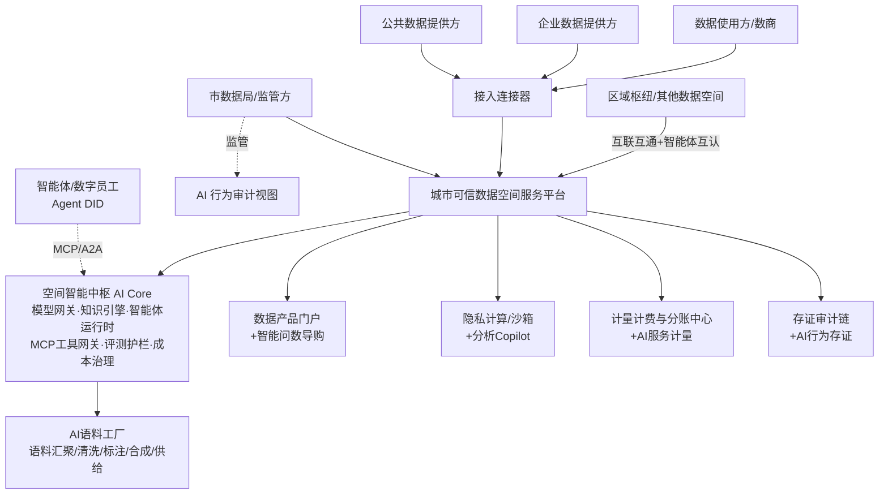

# 城市可信数据空间平台 PRD V2.0（AI 融合版）

| 文档信息 | 内容 |
| --- | --- |
| 产品名称 | 城市可信数据空间平台（City Trusted Data Space，C-TDS） |
| 文档版本 | **V2.0（AI 融合版）** |
| 编制日期 | 2026-09-05 |
| 文档状态 | 评审稿 |
| 上位文档 | 《城市可信数据空间PRD》V1.0（本版继承其全部业务功能定义与 P0 交付基线） |
| 关联文档 | 《行业可信数据空间PRD》《企业可信数据空间PRD》《C-TDS项目研发章程与开发规范》V2.1 |

## 修订记录

| 版本 | 日期 | 修订说明 |
| --- | --- | --- |
| V1.0 | 2026-08 | 首版发布：可信数据空间基础平台，对标信通院"空间服务平台+接入连接器"架构 |
| V2.0 | 2026-09 | **AI 融合版**：确立"AI-Native 可信数据空间"定位；新增空间智能中枢（C-11）与智能体生态（C-12）两大模块；十大既有模块全面嵌入 AI 增强项（C-x.5+ 续编号）；新增 AI 非功能需求、AI 合规要求与 AI 成功指标；调整版本规划（AI-0 底座预留 / V1.5 智能增效 / V2.0 智能体生态）；**V1.0 的 P0 交付范围与工期承诺保持不变** |

---

## 1. 背景与产品定位

### 1.1 背景

**政策双轮驱动**：《可信数据空间发展行动计划（2024—2028年）》持续推进的同时，国家数据局"数据要素×"行动与"人工智能+"行动形成同频共振，《行业高质量数据集建设行动实施方案》明确提出"以模引数、用数赋模"。截至 2025 上半年全国已建成 524 个行业高质量数据集（29PB），支撑 163 个国产大模型研发；各地数据交易所的高质量数据集交易爆发式增长，主力购买方正是 AI 企业。

**技术格局演变**：智能体（Agent）成为 2025–2026 年 AI 落地的主导范式。Anthropic 的 MCP（Model Context Protocol，智能体连接工具的标准）与 Google 的 A2A（Agent2Agent，智能体互联协议）已同入 Linux 基金会 AAIF 中立治理，"MCP 连工具、A2A 连智能体"成为行业共识；企业级落地普遍需要 MCP 网关、安全护栏与审计层。智能问数（ChatBI）进入 Agentic 分析时代，语义层（NL2MQL2SQL）成为准确率关键；AI 驱动的数据分类分级从合规工具演变为数据流通的前置基础设施；国产开源大模型成熟（全球下载量破百亿次），私有化部署成本大幅下降。

**行业痛点升级**：V1.0 识别的"建而难营"痛点之外，客户新增诉求是——数据空间不能只是"数据货架"，必须回答"数据如何喂给 AI、AI 如何反哺数据流通"：公共数据授权运营需要 AI 语料供给路径，数据集团需要 AI 找到新的收入曲线，监管方需要 AI 行为可管可控。

### 1.2 产品定位（V2.0 升级）

面向**地方数据集团/数据局**的城市级**"数据 × 智能"双要素流通基础设施**：在 V1.0"可信管控、资源交互、价值共创"三大能力基础上，以**空间智能中枢（AI Core）**为底座、以**智能体生态**为增量，实现"**空间为 AI 供高质量数据，AI 为空间提流通效率**"的双向赋能飞轮，帮助客户从"建平台"走向"建智能体驱动的数据运营体系"。

**一句话定位**：可信数据空间为 AI 供数，AI 为可信数据空间增效——建设即运营，交付即智能。

### 1.3 目标客户与商业模式（V2.0 增补）

- 直接客户、交付模式不变（私有化部署为主，政务云/国资云）；
- 商业模式在"平台建设费 + 年度运维费 + 运营分成"基础上，**新增三条 AI 收入曲线**：
  1. **AI 增值订阅**：智能问数、智能客服、运营助手的按席位/按量订阅；
  2. **语料与数据集产品分成**：AI 语料工厂产出的语料产品（领域语料/指令集/评测集）交易分成；
  3. **智能体服务计量**：第三方智能体/数字员工接入的调用计量与服务分成（连接器 + Agent DID 计费）。

## 2. 产品目标与成功指标

### 2.1 产品目标

| 编号 | 目标 | 说明 |
| --- | --- | --- |
| G1–G4 | （继承 V1.0）标准合规、快速建设、可持续运营、AI 就绪 | 定义不变 |
| **G5（新）** | **AI 原生增效** | 核心业务流程（找数、撮合、合约、客服、审计）AI 辅助覆盖率 ≥80%，供需匹配效率可量化提升 |
| **G6（新）** | **AI 供数闭环** | 形成"公共/企业数据 → 语料产品 → 模型/智能体"的合规供给闭环，语料产品成为平台新的交易品类 |
| **G7（新）** | **智能体可信接入** | 第三方智能体以可信身份（Agent DID）接入空间，行为全程可审计，成为数据空间的新一类"主体" |

### 2.2 成功指标（运营侧参考值，V2.0 增补 AI 指标）

| 指标 | 上线6个月 | 上线12个月 |
| --- | --- | --- |
| （继承）接入主体数 | ≥30 | ≥100 |
| （继承）上架数据产品数 | ≥50 | ≥200 |
| （继承）月调用量 / 交易额 / 连接器数 | ≥1000 / 50万 / 20 | ≥10000 / 500万 / 60 |
| **智能问数/智能助手月调用次数（新）** | ≥2000 | ≥20000 |
| **语料/数据集类产品上架数（新）** | ≥10 | ≥50 |
| **接入智能体数（数字员工/第三方 Agent）（新）** | — | ≥10 |
| **AI 撮合引导成交占比（新）** | ≥15% | ≥30% |

## 3. 用户与角色（V2.0 增补）

| 角色 | 说明 | 核心诉求 | 状态 |
| --- | --- | --- | --- |
| （继承 V1.0 全部七类角色） | 空间运营方、数据提供方、使用方、服务方、监管方、个人主体、平台管理员 | 不变 | 继承 |
| **AI 应用开发商 / 智能体服务商（新）** | 开发面向城市场景的智能体与 AI 应用的数商 | 便捷接入、工具调用（MCP）、合规经营、计酬透明 | V2.0 |
| **数字员工 / 智能体主体（新）** | 代表主体执行任务的可信智能体（如"供方智能体"自动响应订购、"监管智能体"自动巡查） | 可信身份、最小授权、行为留痕 | V2.0 |
| **模型服务商（新，可选）** | 提供私有化模型部署/微调服务的伙伴 | 模型资产目录、计量结算 | V2.0 |

## 4. 总体业务架构（V2.0）

### 4.1 核心业务流程（V2.0 增补两条）

1. （继承）公共数据授权运营流程；
2. （继承）数据产品交易流程；
3. （继承）主体入驻流程；
4. **（新）语料供给流程**：数据资源接入 → AI 语料工厂汇聚/清洗/标注/质检/合成 → 语料产品封装（语料库/指令集/评测集）→ 合规审查（来源合法性、个人信息处理合规、质量评测）→ 上架交易 → 交付（下载/沙箱内使用/API）→ 计量分账；
5. **（新）智能体可信协作流程**：智能体注册 → Agent DID 签发 + 主体绑定授权 → 能力声明（Agent Card）发布 → 通过 MCP 调用空间工具 / 通过 A2A 与其他智能体协作 → 行为全程上链存证 → 计量结算 → 授权到期回收。

## 5. AI 能力总体设计（V2.0 新增章节）

### 5.1 设计原则（五条，与平台"可信"基因一脉相承）

| 原则 | 内容 |
| --- | --- |
| **可信优先** | AI 的每一次关键输出可溯源（引用/依据）、可审计（行为上链）、可追责（Agent DID + 主体绑定）；无溯源不输出 |
| **人机协同** | AI 做建议，人做裁决：合约签署、策略生效、语料上架、分类分级定级等高风险节点强制人工确认 |
| **模型中立** | 模型网关统一抽象，支持国产主流大模型替换与混部（GLM/Qwen/DeepSeek/文心/星火等），避免单一模型绑定 |
| **私有可控** | 全部模型私有化/信创环境部署；敏感数据脱敏后方可进入模型上下文；prompt 与输出纳入审计日志 |
| **效果可评测** | 每个 AI 功能配套评测集与质量门禁（准确率/幻觉率/合规率），上线前后持续评测，不达门槛不上线 |

### 5.2 空间智能中枢（AI Core）——平台级 AI 基础设施

六大组件，对应功能模块 C-11（见 §6.11）：

1. **模型网关**：多模型统一接入与路由（主备/降级/灰度），OpenAI 兼容 API，按 token/次计量，成本预算控制；
2. **知识引擎**：向量检索 + Agentic RAG + GraphRAG（图谱化语义目录）；承载平台知识库（目录元数据、政策法规、合约模板、运营知识）；
3. **智能体运行时**：Agent 编排（规划/工具/记忆）、多智能体协作框架、会话与记忆管理；
4. **MCP 工具网关**：将平台能力封装为标准化 MCP 工具（目录查询、产品检索、订购、交付状态、合约核验等），供内外部智能体安全调用；企业级安全层（鉴权、限流、脱敏、审计）；
5. **评测与护栏中心**：评测集管理与自动化评测流水线；输入/输出双向护栏（敏感信息检测、prompt 注入防护、内容合规审核、幻觉与越权检测）；
6. **AI 可观测与成本治理**：全链路调用监控、质量抽样评估、按主体/功能的成本分摊与预算熔断。

### 5.3 市场 AI 能力 → 平台落点映射

| 市场 AI 能力（2025–2026 主流） | 平台落点 | 模块 |
| --- | --- | --- |
| MCP（工具互联）+ 企业级 MCP 网关 | 平台能力 MCP 化，供内外智能体调用 | C-11.4 |
| A2A（智能体互联） | 跨空间/跨主体智能体协作与互认 | C-12.3 |
| Agent 身份与最小授权 | Agent DID + 主体绑定 + 行为存证 | C-12.1/12.2 |
| 智能问数 / ChatBI（语义层 NL2MQL2SQL、Agentic 分析） | 智能问数门户：对话式找数、问数、导购 | C-7.6 |
| Agentic RAG / GraphRAG | 知识引擎 + 语义目录 + 政策/合约知识库 | C-11.2、C-3.7 |
| AI 数据分类分级（多模态识别、动态防护闭环） | 资源登记时 AI 分类分级建议 + 人工复核 | C-3.6 |
| 合同智能审查（Legal AI） | 合约智能助手：起草/审查/风险提示 | C-4.5 |
| 策略即代码 + 自然语言生成 | 自然语言使用需求 → 使用控制策略草稿 | C-4.6 |
| 合成数据 / 数据增广 | 语料工厂合成与质检 | C-7.5 |
| 数据标注智能化 | 语料工厂智能标注（模型预标 + 人工终审） | C-7.5 |
| NL2SQL / 数据分析 Copilot | 沙箱内对话式数据分析与报告生成 | C-5.5 |
| 数字人 / 智能客服 | 门户智能客服与入驻引导数字人 | C-7.7 |
| LLMOps（评测/护栏/可观测） | 评测与护栏中心 + AI 可观测 | C-11.5/11.6 |
| AIOps | 平台智能运维 | C-10.4 |
| AI 辅助撮合推荐 | 供需智能匹配升级 | C-3.4 增强 |

## 6. 功能需求

> 优先级定义（V2.0）：**P0 必须**（V1.0 上线门槛，范围与 V1.0 完全一致）；**P0-AI 底座预留**（V1.0 仅做架构预留与最小可用，不承载重功能）；P1 重要（首年迭代）；P2 增强（规划储备）。

### 6.1 主体与身份管理

| 编号 | 功能 | 说明 | 优先级 |
| --- | --- | --- | --- |
| C-1.1 ~ C-1.4 | （继承 V1.0）主体注册实名认证、DID、资质信用、个人授权 | 定义不变 | P0/P1 |
| **C-1.5** | AI 辅助核验与风险画像 | 多模态证照核验（营业执照/身份证/资质证书的 OCR+要素抽取+真伪校验辅助）、主体入驻风险画像初筛（工商/司法/经营异常信号聚合），结果供人工审核参考 | P1 |
| **C-1.6** | 主体信用智能评估 | 基于交易履约、质量评价、违规记录的信用动态评分（V1.0 的资质信用管理 AI 化） | P2 |

### 6.2 逻辑空间管理

| 编号 | 功能 | 说明 | 优先级 |
| --- | --- | --- | --- |
| C-2.1 ~ C-2.3 | （继承）空间创建、成员权限、隔离与策略继承 | 定义不变 | P0 |
| **C-2.4** | 空间策略智能生成 | 运营者用自然语言描述场景诉求（如"医疗数据只允许市内三甲医院科研用途"），AI 生成空间准入/可见性/策略继承配置草稿，人工确认后生效 | P2 |

### 6.3 数据目录与资源交互

| 编号 | 功能 | 说明 | 优先级 |
| --- | --- | --- | --- |
| C-3.1 ~ C-3.3 | （继承）资源登记、统一目录、产品封装上架 | 定义不变 | P0 |
| C-3.4 | 供需撮合 | （继承 P1）需求发布、智能匹配推荐、撮合工单；**V2.0 增强**：语义检索 + 智能体撮合官（自动生成供需匹配报告） | P1 |
| **C-3.5** | 元数据智能识别（升级） | 多模态文档解析（表格/报告/数据库 schema）自动生成元数据与语义标签、元数据补全建议、数据血缘推断；人工确认入库 | P1（由 P2 提前） |
| **C-3.6** | AI 数据分类分级 | 资源登记时自动识别敏感字段与建议定级（对标数据分类分级规范），**强制人工复核闭环**后生效；支撑流通前置合规 | P1 |
| **C-3.7** | 语义目录（知识图谱） | 目录升级为 GraphRAG 语义目录：产品/资源/场景/政策实体关联图谱，支撑智能问答与推理式检索 | P2 |

### 6.4 数字合约与使用控制

| 编号 | 功能 | 说明 | 优先级 |
| --- | --- | --- | --- |
| C-4.1 ~ C-4.3 | （继承）合约模板、协商签署、使用控制策略引擎 | 定义不变；策略引擎为 AI 生成策略的执行底座 | P0 |
| C-4.4 | 合约履约监测 | （继承 P1）**V2.0 增强**：AI 异常检测（调用模式偏离、疑似违约行为识别）与分级预警 | P1 |
| **C-4.5** | 合约智能助手 | 基于政策法规/合约知识库的 RAG：合约条款智能起草、风险条款审查提示、双方协商差异对比；输出仅为建议，签署仍走人工电子签署 | P1 |
| **C-4.6** | 策略即代码 AI 生成 | 供方用自然语言描述使用限制（"每日最多调用 1000 次、禁止转售、仅限本市域内 IP"），AI 生成使用控制策略 DSL 草稿 → 模拟执行验证 → 人工确认后注入 C-4.3 策略引擎 | P1 |

### 6.5 数据交付与隐私计算

| 编号 | 功能 | 说明 | 优先级 |
| --- | --- | --- | --- |
| C-5.1 ~ C-5.4 | （继承）API/文件交付、数据沙箱、隐私计算、TEE | 定义不变 | P0/P1/P2 |
| **C-5.5** | 对话式数据分析 Copilot | 数据沙箱内的分析智能体：自然语言查询（NL2SQL，基于语义层）、自动探索性分析、图表生成、分析报告撰写；全程在沙箱内执行，结果经审核后导出 | P2 |
| **C-5.6** | 隐私计算 AI 增强 | 联邦建模任务的特征建议、算法推荐、训练效果分析助手 | P2 |

### 6.6 接入连接器

| 编号 | 功能 | 说明 | 优先级 |
| --- | --- | --- | --- |
| C-6.1 ~ C-6.4 | （继承）标准连接器、生命周期管理、多源适配、轻量连接器 | 定义不变 | P0/P1 |
| **C-6.5** | 智能连接器 | 连接器内置轻量 AI 代理（可选启停）：源端元数据自动抽取、本地敏感数据识别与脱敏建议、接入质量自检报告 | P2 |

### 6.7 运营与价值共创

| 编号 | 功能 | 说明 | 优先级 |
| --- | --- | --- | --- |
| C-7.1 ~ C-7.4 | （继承）产品门户、计量计费、收益分账、应用开发环境 | 定义不变 | P0/P1 |
| **C-7.5** | AI 语料工厂（升级为核心产品线） | 全量能力：语料汇聚（多源接入）→ 清洗（去重/脱敏/质量过滤）→ 智能标注（模型预标 + 人工终审）→ 质检（质量评测集与合格率门禁）→ 合成（指令集生成/数据增广）→ **语料产品化与交易**（领域语料库/指令集/评测集作为新产品形态上架，含来源合法性证明与质量报告）；对接国家高质量数据集建设要求 | V1.0 预留 / V2.0 全量（P1） |
| **C-7.6** | 智能问数门户 | 面向使用方与运营方的对话式入口："找数"（自然语言检索目录与产品）、"问数"（对已订购产品的授权范围内问答，语义层 NL2MQL2SQL + 溯源引用）、"导购"（场景化推荐与订购引导）；全部回答带依据引用，超出授权范围的数据不可见 | P1 |
| **C-7.7** | 智能客服与数字人 | 门户 7×24 智能客服（入驻指引、产品咨询、工单发起）、可选数字人形象；知识库 RAG + 人工兜底转接 | P1 |
| **C-7.8** | 运营智能助手 | 面向运营方的经营分析 Copilot：运营日报/月报自动生成、供需缺口分析、定价参考建议、活跃度归因 | P2 |

### 6.8 存证审计与监管

| 编号 | 功能 | 说明 | 优先级 |
| --- | --- | --- | --- |
| C-8.1 ~ C-8.3 | （继承）区块链存证、合规审计、安全态势监控 | 定义不变 | P0/P1 |
| **C-8.4** | AI 行为审计 | 智能体与 AI 功能调用（模型网关请求、MCP 工具调用、Agent 协作事件）全量上链存证；异常行为识别（越权尝试、高频异常调用、prompt 注入攻击）与告警 | P1 |
| **C-8.5** | 审计智能问答 | 监管方自然语言查证（"某产品近一月被谁调用多少次、合约依据是什么"），答案附存证引用链 | P2 |

### 6.9 互联互通

| 编号 | 功能 | 说明 | 优先级 |
| --- | --- | --- | --- |
| C-9.1 ~ C-9.2 | （继承）区域枢纽对接、跨空间产品互挂 | 定义不变 | P1/P2 |
| **C-9.3** | 跨空间智能体互认 | 基于 Agent DID 与 A2A 协议的跨空间智能体身份互认与受控协作（预留信通院互联互通规范演进接口） | P2 |

### 6.10 系统管理

| 编号 | 功能 | 说明 | 优先级 |
| --- | --- | --- | --- |
| C-10.1 ~ C-10.3 | （继承）多租户三员分立、监控运维、配置中心 | 定义不变 | P0/P1 |
| **C-10.4** | AIOps 智能运维 | 指标异常检测、告警降噪聚类、根因分析建议、容量预测；产出建议由运维人员确认执行 | P2 |

### 6.11 空间智能中枢（V2.0 新增模块）

| 编号 | 功能 | 说明 | 优先级 |
| --- | --- | --- | --- |
| **C-11.1** | 模型网关 | 国产大模型多模型接入（私有化部署）、统一 OpenAI 兼容 API、智能路由/降级/灰度、按 token/次计量计费、模型资产目录 | P0-AI 底座预留（V1.0 接口预留）/ P1 |
| **C-11.2** | 知识引擎 | 向量数据库 + 检索服务、Agentic RAG 编排（检索/重排/生成/引用溯源）、GraphRAG（V2.0）、平台知识库管理（政策法规/合约模板/运营知识，来源可管理可更新） | P0-AI 底座预留（向量检索）/ P1 |
| **C-11.3** | 智能体运行时 | Agent 编排（任务规划、工具调用、记忆）、多智能体协作框架、会话管理、内部平台智能体（撮合官/客服/审计助手）的承载运行环境 | P1 |
| **C-11.4** | MCP 工具网关 | 平台核心能力封装为标准 MCP 工具（目录查询/产品检索/订购/交付状态/合约核验/存证查询）；企业级安全层（身份鉴权、最小授权、限流、敏感字段脱敏、全量审计）；对外提供 MCP Server，对内支持智能体作为 MCP Client | P1 |
| **C-11.5** | 评测与护栏中心 | 评测集管理与自动化评测流水线（上线前门禁 + 上线后持续评测）；输入护栏（prompt 注入检测、敏感信息识别）与输出护栏（内容合规审核、幻觉/越权检测、强制引用溯源）；AI 生成内容标识（合规要求） | P0-AI 底座预留（护栏框架与审计日志）/ P1 |
| **C-11.6** | AI 可观测与成本治理 | 模型调用全链路监控（延迟/成功率/质量抽样）、按功能与主体的成本核算、预算与熔断（超限自动降级或停用） | P1 |

### 6.12 智能体生态（V2.0 新增模块）

| 编号 | 功能 | 说明 | 优先级 |
| --- | --- | --- | --- |
| **C-12.1** | 智能体身份与接入（Agent DID） | 智能体注册、Agent DID 签发、与所属主体绑定、授权链管理（主体对智能体的委托授权范围/期限）、能力声明（Agent Card：能做什么、调用哪些工具）发布与核验 | P1 |
| **C-12.2** | 智能体行为管控 | 最小授权执行（授权范围外的工具调用一律拒绝）、调用配额、行为存证（对接 C-8.4）、违规智能体冻结与主体连带处置 | P1 |
| **C-12.3** | 智能体互联（MCP/A2A） | 平台智能体通过 MCP 调用平台工具、通过 A2A 与外部智能体点对点协作（任务委托/状态同步）；跨空间互认预留（C-9.3） | P2 |
| **C-12.4** | 智能体市场 | 第三方智能体/数字员工上架展示、订阅/按次计费、评价与质量分、收益分成 | P2 |

## 7. 非功能需求

### 7.1 继承 V1.0（全部不变）

性能（门户 ≥1000 并发、网关 ≥2000 TPS、检索 ≤500ms）、可用性 ≥99.9% 同城双活、微服务扩展、等保三级 + 国密 + KMS、国产化兼容、可运维性。

### 7.2 AI 专项非功能需求（V2.0 新增）

| 类别 | 要求 |
| --- | --- |
| **AI 效果** | 智能问数：授权范围内问答准确率 ≥85%（上线时），随评测迭代 ≥95%；目录语义检索 Top5 命中率 ≥90%；智能客服问题解决率 ≥60%，转人工率 ≤40% |
| **可溯源** | AI 输出涉及数据/合约/政策的事实性内容必须 100% 附依据引用（RAG 引用或存证引用），无引用不输出 |
| **幻觉与安全** | 幻觉拦截护栏上线，抽检幻觉率 ≤5%；prompt 注入防护测试通过率 100%（对抗测试集）；AI 生成内容 100% 合规审核并按规定添加生成标识 |
| **AI 性能** | 智能问数/客服响应 P95 ≤3s（首 token ≤1.5s）；批量 AI 任务（元数据抽取/语料清洗）支持异步与断点续跑 |
| **模型合规与国产化** | 全部模型私有化部署、支持信创环境；使用生成式 AI 服务的备案/登记/算法备案要求由部署方案满足；训练/微调用数据来源合法性可证明（对接语料工厂合规审查） |
| **成本治理** | 单次智能问数综合成本上限可配置；按主体/功能预算控制，超限熔断降级；模型用量报表透明 |
| **数据保护** | 敏感数据进入模型上下文前强制脱敏；个人数据相关 AI 功能默认关闭、显式开启且受个人授权约束（对接 C-1.4） |

## 8. 数据与接口需求

### 8.1 继承 V1.0

数据资产（主体库、DID/证书、目录元数据、合约库、策略库、计量流水、存证记录、审计日志）+ 对外开放 API/Webhook/互联互通接口 + 对内集成。

### 8.2 V2.0 新增

| 类别 | 内容 |
| --- | --- |
| 新增数据资产 | 向量索引与知识库、Agent 卡片与授权链、AI 调用流水（模型网关/MCP/智能体）、评测集与评测报告、语料产品资产（语料库/指令集/评测集及其质量与合规报告）、AI 成本台账 |
| 新增对外接口 | **MCP Server**（目录/订购/交付/合约/存证工具集，含企业级安全层）、模型网关 API（OpenAI 兼容）、A2A 智能体协作接口（V2.0）、智能问数 API |
| 新增对内集成 | 政务大模型/城市算力平台（可选）、电子证照 AI 核验服务、内容安全审核服务、算力资源监控 |

## 9. 版本规划（V2.0 调整）

> **P0 不膨胀原则**：V1.0 的 P0 交付范围与 3 个月工期承诺保持不变；AI 能力以"底座预留 + 递进交付"方式融入，避免冲击测评与上线。

| 版本 | 时间（相对） | AI 融合范围 |
| --- | --- | --- |
| V1.0 基础版 | T+3 个月 | 继承 V1.0 全部 P0；**AI-0 底座预留**：模型网关接口与国产模型私有化接入通道、向量库与目录语义检索（最小可用）、护栏与 AI 审计日志框架（为 C-8.4/C-11.5 打底）；通过信通院测评 |
| V1.5 运营版 | T+6 个月 | **AI 智能增效**：智能问数门户（C-7.6）、元数据智能识别（C-3.5）、AI 分类分级（C-3.6）、合约智能助手（C-4.5）、策略即代码 AI 生成（C-4.6）、智能客服（C-7.7）、模型网关/知识引擎/评测护栏全量（C-11.1/11.2/11.5/11.6）、智能体运行时与 MCP 工具网关（C-11.3/11.4）、Agent DID 与行为管控（C-12.1/12.2）、AI 行为审计（C-8.4）；继承 V1.0 的 P1 业务功能（撮合、分账、隐私计算等） |
| V2.0 智能版 | T+12 个月 | **智能体生态与语料闭环**：AI 语料工厂全量与语料产品交易（C-7.5）、对话式分析 Copilot（C-5.5）、语义目录 GraphRAG（C-3.7）、智能体互联与智能体市场（C-12.3/12.4）、跨空间智能体互认（C-9.3）、AIOps（C-10.4）、运营智能助手（C-7.8）、审计智能问答（C-8.5）及 C-1.5/1.6/2.4/4.7/5.6/6.5 等增强项；继承 P2 业务功能 |

## 10. 运营机制设计（V2.0 增补）

| 机制 | 内容 |
| --- | --- |
| （继承）入驻管理 / 收益分配 / 质量评价 / 激励政策 | 定义不变；质量评价体系扩展至 AI 产品（语料产品质量评测、智能体服务质量分） |
| **AI 服务运营（新）** | 智能问数/客服等 AI 功能的效果运营：评测集月度更新、坏例回流、准确率看板公示 |
| **语料合规审查（新）** | 语料产品上架前强制合规审查：来源授权链完整性、个人信息处理合法性（脱敏/授权证明）、质量评测报告；运营方留存审查记录供监管调阅 |
| **智能体准入（新）** | 智能体服务商入驻资质审核、Agent 能力声明核验、违规处置与退出机制；智能体行为纳入主体信用 |

## 11. 风险与依赖

| 风险/依赖 | 影响 | 应对 |
| --- | --- | --- |
| （继承）授权政策差异 / 数据供给不足 / 信通院标准演进 / 政务云异构 | 不变 | 不变（策略模板引擎、运营辅导包、标准适配层、标准交付镜像） |
| **AI 幻觉导致错误决策** | 问数/合约/审计建议出错误导用户 | 溯源强制 + 护栏拦截 + 高风险节点人工确认（设计原则 2）+ 效果评测门禁 |
| **AI 合规风险**（生成式 AI 备案、内容标识、个人信息用于训练） | 上线受阻或监管处罚 | AI 合规清单前置评审；私有化国产模型；语料来源合法性证明体系；生成内容标识 |
| **智能体越权与滥用** | 数据泄露、恶意调用 | Agent DID 最小授权 + 配额 + 行为存证 + 异常检测 + 主体连带责任 |
| **prompt 注入与对抗攻击** | AI 输出被操纵 | 输入护栏 + 对抗测试集 + 工具调用白名单 + 输出复核 |
| **模型效果不达预期** | AI 功能沦为摆设 | 评测驱动上线（不达门槛不上线）；场景由易到难（检索→问数→生成）；人工兜底通道 |
| **模型与算力成本失控** | 运营亏损 | 成本治理（C-11.6）：预算、熔断、缓存、小模型优先路由 |
| **协议标准演进**（MCP/A2A/互联互通规范） | 接口返工 | 协议适配层独立演进（同 G1 架构解耦策略） |

## 12. 附录：关键术语（V2.0 增补）

| 术语 | 说明 |
| --- | --- |
| （继承）可信数据空间 / 接入连接器 / 逻辑空间 / 使用控制 / DID | 定义同 V1.0 |
| **空间智能中枢（AI Core）** | 平台级 AI 基础设施：模型网关、知识引擎、智能体运行时、MCP 工具网关、评测护栏、AI 可观测 |
| **Agent DID** | 智能体的分布式数字身份，绑定所属主体并承载委托授权链 |
| **Agent Card** | 智能体能力声明：可执行的任务、可调用的工具、服务边界 |
| **MCP** | Model Context Protocol，智能体连接工具与上下文的开放标准（Anthropic 发起，现属 Linux 基金会 AAIF 治理） |
| **A2A** | Agent2Agent，智能体之间点对点协作的开放协议（Google 发起，现属 AAIF 治理） |
| **Agentic RAG / GraphRAG** | 带规划与工具调用的检索增强生成 / 基于知识图谱的检索增强生成 |
| **语义层（NL2MQL2SQL）** | 自然语言到指标查询再到 SQL 的分层转换架构，智能问数准确率的关键 |
| **语料产品** | 以 AI 训练/评测为目的封装的数据产品形态：领域语料库、指令集、评测集 |
| **护栏（Guardrails）** | 对 AI 输入/输出进行安全、合规、质量拦截的技术机制 |
| **AI 行为存证** | 智能体与 AI 功能调用事件的区块链存证，实现"AI 行为可审计" |
