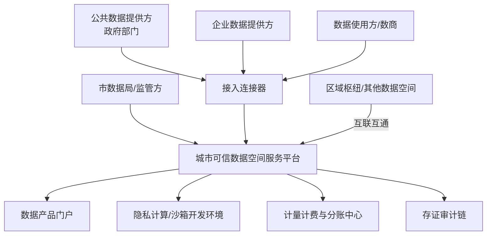

# 城市可信数据空间平台 PRD（产品需求文档）

| 文档信息 | 内容 |
| --- | --- |
| 产品名称 | 城市可信数据空间平台（CityTrusted Data Space，简称 C-TDS） |
| 文档版本 | V1.0 |
| 编制日期 | 2026年8月 |
| 文档状态 | 评审稿 |
| 关联文档 | 《国内可信数据空间平台竞品调研报告》《行业可信数据空间PRD》《企业可信数据空间PRD》 |

## 修订记录

| 版本 | 日期 | 修订人 | 修订说明 |
| --- | --- | --- | --- |
| V1.0 | 2026-08 | 产品团队 | 首版发布 |

---

## 1. 背景与产品定位

### 1.1 背景

依据《可信数据空间发展行动计划（2024—2028年）》，城市可信数据空间围绕城市规划、交通出行、医疗健康等场景，推动公共数据、企业数据、个人数据融合应用，支撑城市全域数字化转型。竞品调研显示：城市空间均由地方国有数据集团主导建设运营，以公共数据授权运营为牵引；当前共性痛点是"建而难营"——数据产品上架多、实际调用少、收益模式未跑通。

### 1.2 产品定位

面向**地方数据集团/数据局**提供的城市级数据流通利用基础设施平台产品，对标《可信数据空间 技术架构》"空间服务平台 + 接入连接器"标准架构，具备**可信管控、资源交互、价值共创**三大核心能力，并内置运营计量计费与AI语料供给能力，帮助客户实现"建设即运营"。

### 1.3 目标客户与商业模式

- **直接客户**：地方数据集团、市数据局（含二梯队非国家试点城市）；
- **交付模式**：私有化部署为主（政务云/国资云），运营平台可按需SaaS托管；
- **商业模式**：平台建设费 + 年度运维服务费 + 运营收入分成（数据产品交易额/调用额的约定比例）。

## 2. 产品目标与成功指标

### 2.1 产品目标

| 编号 | 目标 | 说明 |
| --- | --- | --- |
| G1 | 标准合规 | 全量对标国家技术架构最小功能集，一次通过信通院数据空间产品测评与互联互通测试 |
| G2 | 快速建设 | 单城市平台从部署到具备基础运营能力 ≤ 3个月 |
| G3 | 可持续运营 | 支撑数据产品上架、交易、调用、分账全闭环，运营首年形成可计量收益 |
| G4 | AI就绪 | 具备高质量语料汇聚、治理、供给能力，支撑城市AI语料库场景 |

### 2.2 成功指标（平台运营侧参考值）

| 指标 | 上线6个月 | 上线12个月 |
| --- | --- | --- |
| 接入主体数 | ≥30 | ≥100 |
| 上架数据产品数 | ≥50 | ≥200 |
| 数据产品月调用量 | ≥1000次 | ≥10000次 |
| 数据交易额（累计） | ≥50万元 | ≥500万元 |
| 接入连接器数 | ≥20 | ≥60 |

## 3. 用户与角色

| 角色 | 说明 | 核心诉求 |
| --- | --- | --- |
| 空间运营方 | 数据集团运营公司 | 空间治理、供需撮合、运营收益、合规审计 |
| 数据提供方 | 政府部门（公共数据）、市属国企、社会企业 | 安全授权、价值变现、过程可控 |
| 数据使用方 | 数商、金融机构、科研院所、开发者 | 便捷发现、合规获取、稳定调用 |
| 数据服务方 | 第三方服务商（治理、开发、评估） | 服务上架、计酬透明 |
| 监管方 | 市数据局、网信、审计 | 全程可溯、风险可查、授权合规 |
| 个人主体 | 市民（涉个人数据场景） | 知情同意、授权可撤回 |
| 平台管理员 | 运营方技术人员 | 系统运维、监控告警 |

## 4. 总体业务架构与核心流程

### 4.1 业务架构

### 4.2 核心业务流程

1. **公共数据授权运营流程**：授权运营方案备案 → 授权链存证 → 数据资源接入空间 → 产品化开发 → 上架流通 → 收益分账 → 授权到期回收。
2. **数据产品交易流程**：供方上架 → 需方检索订购 → 数字合约协商签署（含使用控制策略） → 交付（API/文件/隐私计算） → 使用控制执行 → 计量计费 → 分账结算。
3. **主体入驻流程**：注册 → 实名认证/资质核验 → DID签发 → 连接器接入 → 审核通过入驻。

## 5. 功能需求

> 优先级定义：P0 必须（上线门槛）；P1 重要（首年迭代）；P2 增强（规划储备）。

### 5.1 主体与身份管理

| 编号 | 功能 | 说明 | 优先级 |
| --- | --- | --- | --- |
| C-1.1 | 主体注册与实名认证 | 企业/机构注册，营业执照OCR+法人核验；政府部门通过政务CA接入 | P0 |
| C-1.2 | 分布式数字身份（DID） | 为每个主体签发DID，支持跨空间身份互认 | P0 |
| C-1.3 | 资质与信用管理 | 主体资质档案、信用评级、黑名单管理 | P1 |
| C-1.4 | 个人主体授权管理 | 涉个人数据场景的知情同意、授权管理、撤回机制 | P1 |

### 5.2 逻辑空间管理

| 编号 | 功能 | 说明 | 优先级 |
| --- | --- | --- | --- |
| C-2.1 | 逻辑空间创建 | 按场景创建逻辑空间（如普惠金融空间、医疗验证空间），设定参与方范围、可见性 | P0 |
| C-2.2 | 空间成员与权限 | 空间内成员准入/退出、角色权限配置 | P0 |
| C-2.3 | 空间隔离与策略继承 | 逻辑隔离保障，空间级策略继承与覆盖规则 | P0 |

### 5.3 数据目录与资源交互

| 编号 | 功能 | 说明 | 优先级 |
| --- | --- | --- | --- |
| C-3.1 | 数据资源登记 | 提供方登记数据资源，元数据采集（数据标识、语义标签） | P0 |
| C-3.2 | 统一数据目录 | 数据产品统一发布、分类检索、订阅收藏 | P0 |
| C-3.3 | 数据产品封装上架 | 产品化封装（API/数据集/报告/模型），定价与上下架管理 | P0 |
| C-3.4 | 供需撮合 | 需求发布、智能匹配推荐、撮合工单 | P1 |
| C-3.5 | 元数据智能识别 | 基于AI的元数据自动补全、语义发现 | P2 |

### 5.4 数字合约与使用控制

| 编号 | 功能 | 说明 | 优先级 |
| --- | --- | --- | --- |
| C-4.1 | 数字合约模板 | 预置公共数据授权、API调用、隐私计算等合约模板 | P0 |
| C-4.2 | 合约协商与签署 | 供需双方在线协商条款、电子签署、合约存证 | P0 |
| C-4.3 | 使用控制策略引擎 | 策略即代码：次数、期限、用途、域内使用、禁止再分发等策略自动执行 | P0 |
| C-4.4 | 合约履约监测 | 履约状态跟踪、违约预警与处置 | P1 |

### 5.5 数据交付与隐私计算

| 编号 | 功能 | 说明 | 优先级 |
| --- | --- | --- | --- |
| C-5.1 | API/文件交付 | 标准API网关交付、加密文件传输 | P0 |
| C-5.2 | 数据沙箱 | 可信开发环境，原始数据不出域，结果审核后导出 | P0 |
| C-5.3 | 隐私计算 | 多方安全计算、联邦学习任务编排 | P1 |
| C-5.4 | 可信执行环境（TEE） | 敏感场景下硬件级可信计算 | P2 |

### 5.6 接入连接器

| 编号 | 功能 | 说明 | 优先级 |
| --- | --- | --- | --- |
| C-6.1 | 标准连接器 | 支持身份管理、资源管理、产品管理、合约管理、交付、使用控制六项功能 | P0 |
| C-6.2 | 连接器注册与全生命周期管理 | 平台侧对连接器注册、核验、升级、注销管理 | P0 |
| C-6.3 | 多源适配 | 适配政务共享交换平台、数据库、对象存储、API网关等 | P0 |
| C-6.4 | 轻量化连接器 | 面向中小企业的SaaS化/免部署连接器 | P1 |

### 5.7 运营与价值共创

| 编号 | 功能 | 说明 | 优先级 |
| --- | --- | --- | --- |
| C-7.1 | 数据产品门户 | 面向社会的"网购式"产品浏览、订购、评价 | P0 |
| C-7.2 | 计量计费中心 | 按调用次数/包月/交易额计量，账单生成 | P0 |
| C-7.3 | 收益分账 | 按合约约定的多方分账规则自动清分，对接支付通道 | P1 |
| C-7.4 | 应用开发环境 | 面向数商/开发者的开发调试、联合建模环境 | P1 |
| C-7.5 | AI语料工厂 | 语料汇聚、清洗、标注、质检、合成与供给管理 | P2 |

### 5.8 存证审计与监管

| 编号 | 功能 | 说明 | 优先级 |
| --- | --- | --- | --- |
| C-8.1 | 区块链存证 | 授权、合约、交付、使用全链路上链存证 | P0 |
| C-8.2 | 合规审计 | 监管方审计视图、日志调阅、审计报告导出 | P0 |
| C-8.3 | 安全态势监控 | 异常行为监测、风险告警、应急处置工单 | P1 |

### 5.9 互联互通

| 编号 | 功能 | 说明 | 优先级 |
| --- | --- | --- | --- |
| C-9.1 | 区域枢纽对接 | 对接国家/区域枢纽节点，目录互挂、身份互认 | P1 |
| C-9.2 | 跨空间产品互挂 | 与其他城市/行业空间数据产品互挂展示与转交付 | P2 |

### 5.10 系统管理

| 编号 | 功能 | 说明 | 优先级 |
| --- | --- | --- | --- |
| C-10.1 | 多租户与权限 | RBAC权限、三员分立（系统/安全/审计管理员） | P0 |
| C-10.2 | 监控运维 | 平台性能监控、连接器健康度、容量告警 | P0 |
| C-10.3 | 配置中心 | 策略模板、费率、审批流可配置 | P1 |

## 6. 非功能需求

| 类别 | 要求 |
| --- | --- |
| 性能 | 门户并发 ≥1000；API网关吞吐 ≥2000 TPS；目录检索响应 ≤500ms |
| 可用性 | 平台可用性 ≥99.9%；核心交付链路支持同城双活 |
| 扩展性 | 微服务架构，支持水平扩容至亿级调用 |
| 安全性 | 等保三级；数据分类分级；传输加密（国密SM2/SM4）；密钥管理（KMS） |
| 兼容性 | 支持主流国产数据库、操作系统、政务云环境；适配 ≥3 家主流隐私计算厂商 |
| 可运维性 | 提供部署工具链、一键巡检、灰度升级 |

## 7. 数据与接口需求

- **数据资产**：主体库、DID/证书、目录元数据、合约库、策略库、计量流水、存证记录、审计日志；
- **对外接口**：开放API（目录查询、产品订购、交付调用）、Webhook（状态通知）、互联互通协议接口（对标信通院互联互通规范）；
- **对内集成**：政务数据共享交换平台、电子证照库、统一身份认证、支付/发票系统、数交所交易系统（可选）。

## 8. 运营机制设计（随平台交付）

| 机制 | 内容 |
| --- | --- |
| 入驻管理 | 主体分级（政府/国企/社会企业/个人），差异化准入与审核SLA |
| 收益分配 | "市场评价贡献、贡献决定报酬"：供数方/运营方/服务方按合约比例分账，平台透明公示 |
| 质量评价 | 数据产品质量评分、调用成功率、争议仲裁流程 |
| 激励政策 | 首批入驻免费期、调用补贴、优秀数商评选（参考厦门模式） |

## 9. 版本规划

| 版本 | 时间（相对） | 范围 |
| --- | --- | --- |
| V1.0 基础版 | T+3个月 | P0 全量：主体身份、逻辑空间、目录、合约、交付、存证审计、连接器、门户、系统管理；通过信通院测评 |
| V1.5 运营版 | T+6个月 | P1：供需撮合、分账、隐私计算、轻量连接器、枢纽对接、安全态势 |
| V2.0 智能版 | T+12个月 | P2：AI语料工厂、跨空间互挂、TEE、元数据智能识别 |

## 10. 风险与依赖

| 风险/依赖 | 影响 | 应对 |
| --- | --- | --- |
| 公共数据授权运营政策各地差异 | 合约与授权模块需逐城适配 | 策略模板引擎+配置化 |
| 客户数据供给不足 | 平台空转 | 运营辅导包：场景规划+首批产品孵化服务 |
| 信通院标准演进 | 测评返工 | 架构解耦，标准适配层独立演进 |
| 政务云环境异构 | 部署交付周期拉长 | 标准交付镜像+自动化部署工具 |

## 11. 附录：关键术语

| 术语 | 说明 |
| --- | --- |
| 可信数据空间 | 基于共识规则、联接多方主体、实现数据资源共享共用的数据流通利用基础设施 |
| 接入连接器 | 部署于参与方侧的标准化数据流通组件 |
| 逻辑空间 | 在物理平台上按场景隔离的虚拟数据流通域 |
| 使用控制 | 对数据使用行为按合约策略进行技术约束与监测 |
| DID | 分布式数字身份标识 |
